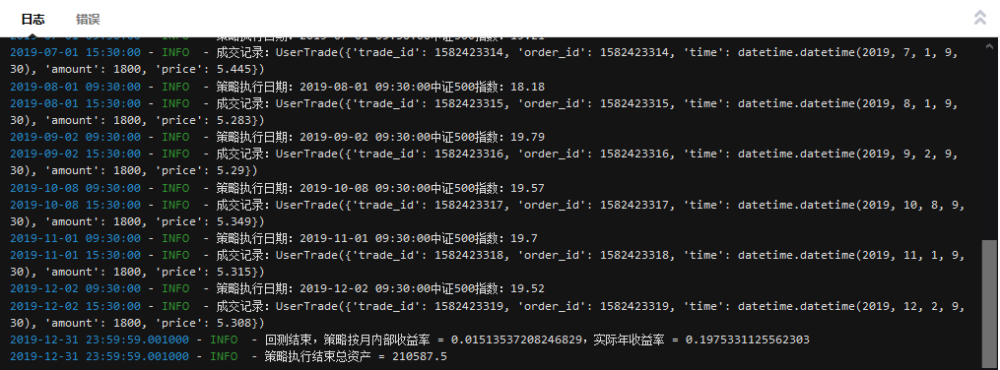

# 聚宽学习第八周周记：我的第一个初级策略——基于中证500ETF的基金定投


## 一、`基于中证500ETF基金定投策略`代码解释

2020年年初的时候决定开始基金定投，不过我是在开始这个投资行动之后才有了在聚宽量化平台上进行基金定投策略模拟这个想法的，所以这个定投策略的初版是在上个月学习后编写的，本身应该在[聚宽学习第四周周记：获取中证指数的市盈率](https://www.joinquant.com/view/community/detail/33a1702904ef143ab8d892e45744b197)里面附带上源代码但后来发现自己忘记附带了。

再过了两周之后自己发现聚宽在策略收益的评估上是基于最初的投入资金进行计算的，对于基金定投连续、多次投入资金，这种计算方式是不准确的，所以重新改了最初的版本在里面加入了打印日志把更能反映连续多次投入资金的收益率，即IRR（内部收益率）打印出来，并在[价值研究笔记之基金定投模拟](https://www.joinquant.com/view/community/detail/3d7d7a201cc6dedc526b5c5e329d9baa)中发布。以下是源代码：

```
from jqdata import *
import numpy as np


def get_zz_quote(code,end_date=None,count=None,start_date=None):
    '''获取中证指数行情,返回panel结构'''
    if isinstance(code,str):
        code=[code]
    code.sort()

    code = [x[:6] for x in code]
    days = get_trade_days(start_date,end_date,count)
    code_df = jy.run_query(query(
         jy.SecuMain.InnerCode,jy.SecuMain.SecuCode,jy.SecuMain.ChiName
        ).filter(
        jy.SecuMain.SecuCode.in_(code)).order_by(jy.SecuMain.SecuCode))
    df = jy.run_query(query(
             jy.QT_CSIIndexQuote).filter(
            jy.QT_CSIIndexQuote.IndexCode.in_(code_df.InnerCode),
            jy.QT_CSIIndexQuote.TradingDay.in_(days),
            ))
    df2  = pd.merge(code_df, df, left_on='InnerCode',right_on='IndexCode').set_index(['TradingDay','SecuCode'])
    df2.drop(['InnerCode','IndexCode','ID','UpdateTime','JSID','OpenInterest','SettleValue','IndexCSIType'],axis=1,inplace=True)
    return df2


def initialize(context):
    set_benchmark('000300.XSHG')
    set_option('use_real_price', True)
    log.set_level('order', 'error')

    set_order_cost(OrderCost(close_tax=0.001, open_commission=0.0003, close_commission=0.0003, min_commission=5), type='stock')
    run_monthly(before_market_open, 1, time='before_open', reference_security='000300.XSHG')
    run_monthly(market_open, 1, time='open', reference_security='000300.XSHG')
    run_monthly(after_market_close, 1, time='after_close', reference_security='000300.XSHG')

    g.cash_income = []
    log.info('策略执行开始总资产 = ' + str(context.portfolio.total_value))


def before_market_open(context):
    g.security = '510500.XSHG'


def try_trade(pe, positions_value):
    security = g.security
    invested_cash = 0.0
    res = None

    if (pe < 20):
        res = order_value(security, 10000)
    elif (pe < 30):
        res = order_value(security, 5000)
    elif (pe < 40):
        res = order_value(security, 1000)
    elif (pe > 50 and positions_value > 0):
        res = order_target_value(security, 0)

    if (None != res):
        invested_cash = res.amount * res.price
        if (res.action == 'open'):
            invested_cash = -invested_cash

    return invested_cash


def market_open(context):    
    df_with_two_index_level = get_zz_quote(['000905.XSHG'], end_date=context.current_dt, count=1)
    df_905 = df_with_two_index_level.xs('000905', level='SecuCode')
    index_pe = df_905['IndexPERatio1'][0]

    log.info('策略执行日期：' + str(context.current_dt) + '中证500指数：' + str(index_pe))
    g.cash_income.append(try_trade(index_pe, context.portfolio.positions_value))


def after_market_close(context):
    trades = get_trades()
    for _trade in trades.values():
        log.info('成交记录：'+str(_trade))


def on_strategy_end(context):
    g.cash_income.append(context.portfolio.positions_value)
    month_rate = np.irr(g.cash_income)
    year_rate = (1 + month_rate)**12 - 1
    log.info('回测结束，策略按月内部收益率 = ' + str(month_rate) + '，实际年收益率 = ' + str(year_rate))
    log.info('策略执行结束总资产 = ' + str(context.portfolio.total_value))
```

聚宽上的策略，有两种运行方式，一种是直接编译运行，你可以查看打印的日志，比如：



另一种是执行回测，除了打印的日志外还能看到更详尽的信息，比如下面这种收益概述：


注：收益概述里面的收益率是基于总的资金进行计算的。


**代码片段一：**

```
from jqdata import *
import numpy as np

def get_zz_quote(code,end_date=None,count=None,start_date=None):
    '''获取中证指数行情,返回panel结构'''
    if isinstance(code,str):
        code=[code]
    code.sort()

    code = [x[:6] for x in code]
    days = get_trade_days(start_date,end_date,count)
    code_df = jy.run_query(query(
         jy.SecuMain.InnerCode,jy.SecuMain.SecuCode,jy.SecuMain.ChiName
        ).filter(
        jy.SecuMain.SecuCode.in_(code)).order_by(jy.SecuMain.SecuCode))
    df = jy.run_query(query(
             jy.QT_CSIIndexQuote).filter(
            jy.QT_CSIIndexQuote.IndexCode.in_(code_df.InnerCode),
            jy.QT_CSIIndexQuote.TradingDay.in_(days),
            ))
    df2  = pd.merge(code_df, df, left_on='InnerCode',right_on='IndexCode').set_index(['TradingDay','SecuCode'])
    df2.drop(['InnerCode','IndexCode','ID','UpdateTime','JSID','OpenInterest','SettleValue','IndexCSIType'],axis=1,inplace=True)
    return df2
```

这段代码的前2行是Python编程语言的基本语法，我们在策略代码里面会使用到`get_trade_days()`等函数被实现在`jqdata`模块中，同时计算内部收益率（IRR）的`irr()`包含在`numpy`中，所以在最上面要将它们`import`进来。至于`from ... import ...`和`import ... as ...`需要涉及到Python里面的“包”和“模块”以及简略命名等的概念，先不展开啦。这里仅仅明白它们的作用，需要的时候照着用就好了。

剩下的部分是获取中证指数行情数据的共享函数`get_zz_quote()`，“共享函数”其实就是一些好心的程序员把一些经常需要使用的数据获取功能写成了函数，然后“共享”出来的意思，比如`get_zz_quote()`就是其中的一个，我这里要使用它是因为我策略里面定投了中证500指数对应的指数基金，所以要接用它来进行中证500指数的估值。这个函数在[聚宽学习第五周周记：中证指数共享函数使用更新与策略指标的理解](https://www.joinquant.com/view/community/detail/99a6ea4179cfa056552d3567b3387bc6)里面进行了详细的拆解，这里就不多说啦。


**代码片段二：**

```
def initialize(context):
    set_benchmark('000300.XSHG')
    set_option('use_real_price', True)
    log.set_level('order', 'error')

    set_order_cost(OrderCost(close_tax=0.001, open_commission=0.0003, close_commission=0.0003, min_commission=5), type='stock')
    run_monthly(before_market_open, 1, time='before_open', reference_security='000300.XSHG')
    run_monthly(market_open, 1, time='open', reference_security='000300.XSHG')
    run_monthly(after_market_close, 1, time='after_close', reference_security='000300.XSHG')

    g.cash_income = []
    log.info('策略执行开始总资产 = ' + str(context.portfolio.total_value))
```

这个函数是聚宽策略默认需要的初始化函数，在这个函数用来在每次策略执行时进行初始化，初始化内容包括两部分：一、设定某些全局变量；二、设定定时运行策略。

更详细的可以参考官方API文档里面的 [策略程序架构](https://www.joinquant.com/help/api/help?name=api#%E7%AD%96%E7%95%A5%E7%A8%8B%E5%BA%8F%E6%9E%B6%E6%9E%84%E2%99%A6)。

如上函数内容包括：

- `set_benchmark()`用来设定策略比较的基准，比如这里以沪深300指数作为收益的对比。
- `set_option()`用来设定`use_real_price`，即“开启动态复权模式”，这个是聚宽建议必须要开启的。
- `log.set_level()`设置日志的打印级别，如上代码里面表示“order系列API产生的比error级别低的log”。
- `set_order_cost()`设置交易的手续费。
- `run_monthly()`设置交易时的执行函数，通过其中的参数`time`来指定对应函数的执行时间，比如这里设置了按照每月开盘前执行、开盘时及开盘后执行，策略的执行时间为每月的第1个交易日。
- `g.cash_income`是自己创建的列表，用来策略执行完成之后计算内部收益率（IRR）。


**代码片段三：**

```
def before_market_open(context):
    g.security = '510500.XSHG'
```

这个是上面指定的在每个月策略前调用的函数，这里仅仅设定策略会操作的证券为某只对应中证500指数的ETF，基金代码为 510500。


**代码片段四：**

```
def try_trade(pe, positions_value):
    security = g.security
    invested_cash = 0.0
    res = None

    if (pe < 20):
        res = order_value(security, 10000)
    elif (pe < 30):
        res = order_value(security, 5000)
    elif (pe < 40):
        res = order_value(security, 1000)
    elif (pe > 50 and positions_value > 0):
        res = order_target_value(security, 0)

    if (None != res):
        invested_cash = res.amount * res.price
        if (res.action == 'open'):
            invested_cash = -invested_cash

    return invested_cash

def market_open(context):
    # 获取中证500 最近交易日的指数
    df_with_two_index_level = get_zz_quote(['000905.XSHG'], end_date=context.current_dt, count=1)
    df_905 = df_with_two_index_level.xs('000905', level='SecuCode')
    index_pe = df_905['IndexPERatio1'][0]

    log.info('策略执行日期：' + str(context.current_dt) + '中证500指数：' + str(index_pe))
    g.cash_income.append(try_trade(index_pe, context.portfolio.positions_value))

    #log.info('账户可用余额：' + str(context.portfolio.cash))
```

这里的`market_open()`是上面指定的在每个月策略执行时调用的函数，这里面的内容包括三部分：

- 先调用`get_zz_quote()`用来获取中证500指数在当天的市盈率。
- 再调用自己定义的`try_trade()`根据市盈率来进行买卖操作，买入卖出规则是在[新年ETF基金定投计划](https://www.joinquant.com/view/community/detail/10c029abcd8f69bd59b8b1172a547d31)确定的那样进行。
- 最后将每次交易的现金保存到全局变量`g.cash_income`中。


**代码片段五：**

```
def after_market_close(context):
    trades = get_trades()
    for _trade in trades.values():
        log.info('成交记录：'+str(_trade))
```

`after_market_close()`也是在`initialize()`设置好的每次策略执行结束后调用的，这里主要是用来打印日志，把每次交易的详细信息打印出来。

**代码片段六：**

```
def on_strategy_end(context):
    g.cash_income.append(context.portfolio.positions_value)
    month_rate = np.irr(g.cash_income)
    year_rate = (1 + month_rate)**12 - 1
    log.info('回测结束，策略按月内部收益率 = ' + str(month_rate) + '，实际年收益率 = ' + str(year_rate))
    log.info('策略执行结束总资产 = ' + str(context.portfolio.total_value))
```

对于`on_strategy_end()`这个函数我在上周的周记里面已经提到过了，摘录如下：


>在执行策略的时候需要在策略完成时计算策略的内部收益率（IRR），但是从写的第一个简单策略里面只有针对定时运行策略的控制，比如可以给run_daily/run_weekly/run_monthly 指定before_market_open/market_open/after_market_close分别在开盘前、中、后执行，但我想要的是在整个策略执行完成的时候计算策略的总体收益。
>
>于是决定阅读[API文档](https://www.joinquant.com/help/api/help?name=api#%E7%AD%96%E7%95%A5%E7%A8%8B%E5%BA%8F%E6%9E%B6%E6%9E%84%E2%99%A6)，在策略程序架构章节里面发现了可以完成这项功能的函数`on_strategy_end()`，定义如下：

```
def on_strategy_end(context)

在回测、模拟交易正常结束时被调用， 失败时不会被调用。

在模拟交易到期结束时也会被调用， 手动在到期前关闭不会被调用。
```

这个函数会默认在整个策略结束时候调用，我们可以通过重写这个函数来决定策略执行结束时要做的工作。


## 二、上周计划任务

### 1.写函数统计基金的成交量，提供按天、月为单位进行统计。

保存在聚宽研究模块里面，但今天似乎还在维护一直无法访问，下周周报里面再放吧。

### 2.如何获取创业板指数的市盈率？

有点忙，没来得及。

## 三、本周新学内容

### 1.更正基金成交量统计代码的两处不足

**不足之一**

在读了API文档中的[数据获取函数](https://www.joinquant.com/help/api/help?name=api#%E6%95%B0%E6%8D%AE%E8%8E%B7%E5%8F%96%E5%87%BD%E6%95%B0)之后突然发现上周编写的用来统计基金成交量的写得太繁冗了:

```
nd = get_ticks('159915.XSHE','2020-02-14 15:30:00','2020-02-14 09:00:00')
df = pd.DataFrame(nd)
print(df['volume'].sum())

# 输出：691 194 074 791 股
```

因为函数`get_ticks()`默认返回的数据类型/格式为`numpy.ndarray`，但可以通过指定`df=True`来返回DataFrame数据，所以如上的代码可以更新为：

```
df = get_ticks('159915.XSHE','2020-02-14 15:30:00','2020-02-14 09:00:00',df=True)
print(df['volume'].sum())

# 输出：691 194 074 791 股
```

**不足之二**

我通过统计`volume`那一列的合来计算当天的成交量是不对的，因为API文档上的解释是tick数据里面的成交量是累加的，也就是说最后一个tick的volume数据就是当天的成交量，而不用再次累加。这一点，我已经通过券商APP确认过，确实如此。所以，获取2020年2月14日的成交量我们使用下面的代码即可，之前的是错误的。

```
df = get_ticks('159915.XSHE',start_dt=None,end_dt='2020-02-15',count=1, df=True)
print(df['volume'])
```

## 四、下周学习任务

### 1.本周未完成的`获取创业板指数市盈率`的任务

### 2.聚宽里企业的年度营业收入增长率如何获得？

这是宽友 @freemars 的一个问题：

> 聚宽的 indicator.inc_revenue_year_on_year, 是（2019q3-2019q2）/(2018q3-2018q2)， 我想要的数据是财报里的 本年至今营收/去年同期营收, 我的选股条件是 营业收入增长率 ＞ 20%。 pe ＞ 15， pe ＜ 60， roe ＞ 15， 每天选股，按照 roe 从 大到小 排序。 排序这个我可以搞定，前面那个选股条件我搞不定。

### 3.开始新的学习计划：学习聚宽社区2019年度评选文章

公众号上看到聚宽发送的《【年度福利】聚宽2019年度评选+精选文章合集》，觉得自己再学会基本的函数和操作之后可以从这里面逐一挑出合适难度的文章来研究。

#### 西安交大元老师量化小组

- [选股因子系列：价格形态选股因子]()
- [多因子系列: 多因子模型体系之因子组合的确定]()
- [趋势突破策略与期权——以Dual Thrust为例]()
- [开盘跳空是否透露超额收益？A股跳一跳因子挖掘]()
- [行业轮动的黄金律：日内动量与隔夜反转]()
- [股价日内模式中蕴藏的选股因子]()
- [多因子系列：基于多因子框架的收益预测模型]()
- [股价日内模式中蕴藏的选股因子]()

#### 东南有大树

- [K线形态识别与验证]()
- [指数估值自动报表系统——源代码]()
- [用指数战胜指数，ETF二八轮动对冲模型]()
- [MACD日、周、月以及分钟级别研究（包含低位二次金叉算法）]()
- [【策略研发】三进兵策略（变形版）]()

#### 云帆

- [高频因子探索——动量交易]()
- [择时，还是宏观数据靠谱（宏观择时集合）]()
- [自然语言处理用于量化分析]()
- [多因子策略研究代码框架]()

#### 一梦春秋

- [林奇PEG选股轮动，十年20倍，有止损模块]()
- [回馈社区，分享市盈率股息率选股+均线止盈交易策略]()
- [套利三年，我的本金翻了10倍]()
- [复现银河证券-基于成交量脉冲的大盘择时策略]()

#### Gyro

- [消费--医药 alpha策略]()
- [小盘价值股策略2.01，年化131%，回撤8.8%]()
- [价值低波（中）-- 市盈率研究]()

#### 恶魔猎手

- [基于随机森林和XGBoost的多因子模型分析]()
- [基于机器学习的多因子选股策略]()
- [基于RFM及K-means的用户价值度分析]()

#### jqz1226

- [向云帆致敬—— 宏观数据择时策略——极速版代码]()
- [量价MACD组合择时——极速版]()
- [策略coding吐槽帖——以“网红”ETF轮动为例]()

#### BAFE

- [市场底部特征研究]()
- [量化排雷—一个实用排雷系统]()
- [海龟交易体系（股票版）]()

#### K线放荡不羁

- [基本面单因子测试——以BP因子为例]()
- [股指期货松绑，作为对冲工具，股指期货与股指走势同步吗？]()
- [探索公开交易信息之扒一扒龙虎榜]()
- [波动率因子在A股市场探索]()
- [财务造假启示录：财务质量因子研究]()
- [低开高走的收益特征]()

#### cicikml

- [MACD+波动率过滤+追踪止损 期货择时汇总]()
- [相信波动率还是相信基本面？波动与估值因子A股驱动力测试]()
- [基于主成分分析 沪深300个股一致性IF股指交易策略]()
- [黄金避险有效？量化实测黄金资产真实收益]()
