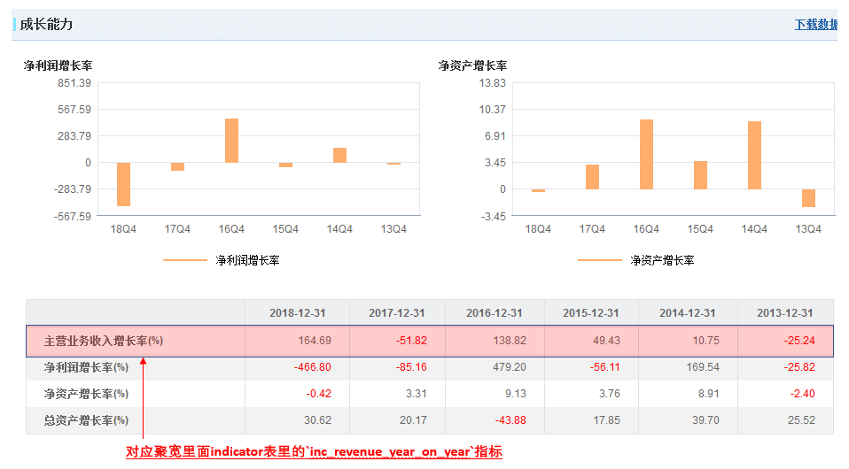

# 聚宽学习周记九：基金成交量、指数估值及按营收同比增长率择股

## 一、代码解释

本周工作比较忙，没有来得及按照计划学习聚宽社区2019年度评选文章。

## 二、上周计划任务

### 1.写函数统计基金的成交量，提供按天、月为单位进行统计。

这个问题是上周的学习任务，由于上周聚宽研究升级无法访问，所以这周将代码放映出来。

聚宽的基金数据里面提供了[获取场内基金tick数据](https://www.joinquant.com/help/api/help?name=fund#%E8%8E%B7%E5%8F%96%E5%9C%BA%E5%86%85%E5%9F%BA%E9%87%91tick%E6%95%B0%E6%8D%AE)的获取函数，由于它是以tick作为统计粒度，那么如果想要获取以天、周或者月为单位的数据就需要自己写函数来统计了。

下面是自己实现的统计函数，支持按天的统计的区间，也就是说必须指定确定的时间段，以周、月为统计单位需要传入对应的时间段。这里的一点技巧是要知道`统计某天的成交量只需要获取第二天开始前的最后一次成交量`就好了。

```
#############################################################################
# 仿照 get_prince()的原型进行设计,
# 1. 支持按天的统计的区间
# 2. 支持成交量（volumn）和成交额（money）的统计
#############################################################################
def get_trade_info(security, start_date=None, end_date=None, field=None):
    trade_days = get_trade_days(start_date, end_date)
    df_list = [get_ticks(security,start_dt=None,end_dt=day+datetime.timedelta(days=1),count=1, df=True) for day in trade_days]
    df = pd.concat(df_list).set_index('time')
    return df[field].sum()

print(get_trade_info('159915.XSHE', start_date='2020-02-17', end_date='2020-02-17', field='volume'))
print(get_trade_info('159915.XSHE', start_date='2020-02-17', end_date='2020-02-17', field='money'))
```

### 2.如何获取创业板指数的市盈率？

聚宽“数据字典”中的“指数数据”并不包含市盈率方面的估值信息，想起中证500的估值是聚宽提供的共享函数去从聚源数据里面获取的（详细的介绍见[聚宽学习第五周周记：中证指数共享函数使用更新与策略指标的理解](https://www.joinquant.com/view/community/detail/99a6ea4179cfa056552d3567b3387bc6))，所以尝试着去查看[聚源数据](https://www.joinquant.com/help/data/data?name=jy)。在[指数估值指标 - LC_IndexDerivative](https://www.joinquant.com/help/data/data?name=jy#nodeId=67)页面可以看到：


其中包含了“PE_TTM（动态市盈率）”。

```
# 获取指数估值指标，包括指数总市值、静态市盈率、动态市盈率、市净率、股息率等指标
#   TotalMV        -- 指数总市值(元)
#   PE_TTM         -- 动态市盈率
#   PE_LYR         -- 静态市盈率(LYR)
#   PB_LF          -- 市净率(LF)
#   DividendRatio  -- 股息率(%)
#   PCF_LYR        -- 静态市现率
#   PCF_TTM        -- 动态市现率
#   PS_LYR         -- 静态市销率
#   PS_TTM         -- 动态市销率

def get_index_derivative(code,start_date=None,end_date=None,count=None):
    if isinstance(code,str):
        code=[code]
    code.sort()

    code = [x[:6] for x in code]
    days = get_trade_days(start_date,end_date,count)

    basic_info_df = jy.run_query(query(
         jy.SecuMain.InnerCode,jy.SecuMain.SecuCode,jy.SecuMain.ChiName
        ).filter(
        jy.SecuMain.SecuCode.in_(code)).order_by(jy.SecuMain.SecuCode))
    #print(basic_info_df)

    derivative_info_df = jy.run_query(query(
             jy.LC_IndexDerivative).filter(
            jy.LC_IndexDerivative.IndexCode.in_(basic_info_df.InnerCode),
            jy.LC_IndexDerivative.TradingDay.in_(days),
            ))

    df = pd.merge(basic_info_df, derivative_info_df, left_on='InnerCode',right_on='IndexCode').set_index(['TradingDay','SecuCode'])
    df.drop(['InnerCode','IndexCode','ID','InsertTime','UpdateTime','JSID'],axis=1,inplace=True)
    return df
```

这里有两点需要注意：

- 如上代码理论上适合于当前市场上的所有指数，但是似乎聚源数据并没有提供所有指数的估值数据，所以有些指数可能无法获取，比如“000928.XSHG 中证能源”就无法获取。
- 由于聚宽对于单次函数调用获取的数据条目有限制，所以时间太长可能无法通过一次获取搞定。

### 3.聚宽里企业的年度营业收入增长率如何获得？

这是宽友 @freemars 的一个问题：

> 聚宽的 indicator.inc_revenue_year_on_year, 是（2019q3-2019q2）/(2018q3-2018q2)， 我想要的数据是财报里的 本年至今营收/去年同期营收, 我的选股条件是 营业收入增长率 ＞ 20%。 pe ＞ 15， pe ＜ 60， roe ＞ 15， 每天选股，按照 roe 从 大到小 排序。 排序这个我可以搞定，前面那个选股条件我搞不定

这个问题之后和freemars讨论他的问题在于在获取股票对应的年营业收入增长率的时候获取到的是季度的营业收入增长率，比如2019年9月份获取到的是2019年半年度的营业收入增长率，2020年2月份的获取到的是2019年三季度的数据，这一点在[财务指标数据](https://www.joinquant.com/help/api/help?name=Stock#%E8%B4%A2%E5%8A%A1%E6%8C%87%E6%A0%87%E6%95%B0%E6%8D%AE)里面有说明，上面的提示信息是`按季度更新, 统计周期是一季度。可以使用get_fundamentals() 的statDate参数查询年度数据。`

所以按照我的理解，参考在聚宽API的[数据获取函数](https://www.joinquant.com/help/api/help?name=api#%E6%95%B0%E6%8D%AE%E8%8E%B7%E5%8F%96%E5%87%BD%E6%95%B0)章节对查询财务数据的函数`get_fundamentals()`的说明，就可以写出想要的按照年度增长率过滤的效果了。

```
get_fundamentals(query_object, date=None, statDate=None)

date和statDate参数只能传入一个:

- 传入date时, 查询指定日期date收盘后所能看到的最近(对市值表来说, 最近一天, 对其他表来说, 最近一个季度)的数据, 我们会查找上市公司在这个日期之前(包括此日期)发布的数据, 不会有未来函数.
- 传入statDate时, 查询 statDate 指定的季度或者年份的财务数据. 注意:


statDate: 财报统计的季度或者年份, 一个字符串, 有两种格式:

1. 季度: 格式是: 年 + 'q' + 季度序号, 例如: '2015q1', '2013q4'.
2. 年份: 格式就是年份的数字, 例如: '2015', '2016'.
```

编写代码的时候，需要参考[财务指标数据](https://www.joinquant.com/help/api/help?name=Stock#%E8%B4%A2%E5%8A%A1%E6%8C%87%E6%A0%87%E6%95%B0%E6%8D%AE)里的indicator表里的`inc_revenue_year_on_year`指标，结果如下：

```
import pandas as pd

def get_stock_name(stock_code):
    stocks_df = get_all_securities()
    stock_name = [stocks_df.loc[c, 'display_name'] for c in stock_code]
    return stock_name


#pd.set_option('display.max_columns', 100)
#pd.set_option('display.max_rows', 100)

# 1. 创建query对象，这是聚宽所规定的调用get_fundamentals()时必须传入的参数
init_filter_query = query(
                            indicator.code, indicator.inc_revenue_year_on_year
                        ).filter(
                            indicator.inc_revenue_year_on_year > 5                           
                        ).order_by(
                            indicator.inc_revenue_year_on_year.desc()
                        ).limit(
                            100
                        )

# 2. 调用 get_fundamentals()获取满足条件的股票, 获取股票列表
df = get_fundamentals(init_filter_query, statDate='2018')
stocks = df['code']

# 3 获取这些股票历年的inc_revenue_year_on_year数据
multi_stock_data_query = query(
                                indicator.code, indicator.inc_revenue_year_on_year
                            ).filter(
                                indicator.code.in_(stocks)
                            )

inc_revenue_dict = {}
year_list = ['2012', '2013', '2014', '2015', '2016', '2017', '2018']
for year in year_list:
    df = get_fundamentals(multi_stock_data_query, statDate=year)
    df = df.set_index('code')
    inc_revenue_dict[year] = df['inc_revenue_year_on_year']


df = pd.DataFrame(inc_revenue_dict)
df.index = get_stock_name(df.index)
print(df)
```

下面是输出结果：

```
               2012      2013      2014    ...          2016       2017       2018
国农科技     30.6825  -25.2444   10.7499    ...      138.8206   -51.8178   164.6850
康达尔       9.2920    7.7031   36.9964    ...      -32.1799    -0.7441   121.7933
ST地矿      3.5882   36.7785  -22.3428    ...       -0.0987   -35.4984   114.3248
我爱我家     77.9360  -35.3085   -8.4272    ...       43.1921   -31.2045   710.9095
海航投资     18.5363    1.4080  -22.8136    ...      -76.7179   -66.2669   179.0924
恒立实业      6.6987   42.0793  -70.1052    ...      -10.9951    40.2759   232.7036
炼石航空     55.1827    6.6823    7.7538    ...      -91.8341  5848.6908   112.8922
*ST大菲        NaN       NaN       NaN    ...           NaN        NaN  1212.8025
铁岭新城     -0.4468   20.7374  -84.3970    ...      -38.8371   279.1233  1847.2648
银泰黄金      5.3048  131.7648   22.2975    ...        4.2376    94.6070   116.6912
ST天润    -65.7615   26.9613  -43.0091    ...      694.6070    56.9906   154.9519
三维通信     -3.2827  -27.0000   14.2959    ...       14.3054    19.4861   200.7875
南极电商      6.4524   21.2341  -61.9488    ...       33.8496    89.2172   240.1202
惠程科技      1.8437   14.8032  -27.6288    ...       37.8507    29.2962   408.6541
海陆重工      2.1824    5.5804   -5.1907    ...      -28.9099     9.9525    94.3818
亚联发展     31.0007   34.9839  -17.8929    ...      -17.2876    47.3532   279.2043
维信诺     -11.0046   -8.6144  -16.3252    ...      -63.0303   -80.0653  5504.4429
益生股份    -21.9319  -16.3851   67.4213    ...      166.6156   -59.2582   124.4223
希努尔       2.7553    6.7641  -18.2452    ...      -31.2696    11.3159   121.9914
光正集团      9.2353    8.5051   23.9156    ...      -10.0668    10.9552   112.1485
领益智造     20.9464   29.6707   46.6222    ...      147.5008    32.1426   133.4805
世纪华通     -6.9916   32.1382   39.4970    ...       14.2135     1.0104   132.7245
...
```

我将`国农科技`的指标和网易财经里面的[年度数据](http://quotes.money.163.com/f10/zycwzb_000004,year.html)核对了一下，是可以核对上的：



上面的代码是先选择2018年营业收入增长率排名最前的100位，再分别获取2012到2018年的各年度的营业收入增长率数据，这只是个例子。如果真正要按照营业收入增长率来选股，需要先获取各个股票2012到2018年的营业收入增长率，然后从中选择能够持续增长的企业。

## 三、本周新学内容

无。

## 四、下周学习任务

浏览了[聚宽2019年度评选+精选文章合集](https://www.joinquant.com/view/community/detail/5fea4e17fa8ad5eb32b85201375e2669?type=1)文章标题，觉得 @Gyro 的比较合我当下的口味，因为当前没有接触过因子，就市盈率勉强算是有些理解了。所以下周的学习任务就选择[价值低波（中）-- 市盈率研究](https://www.joinquant.com/view/community/detail/328831058b45f5f1080914aaea6e0d09)。
