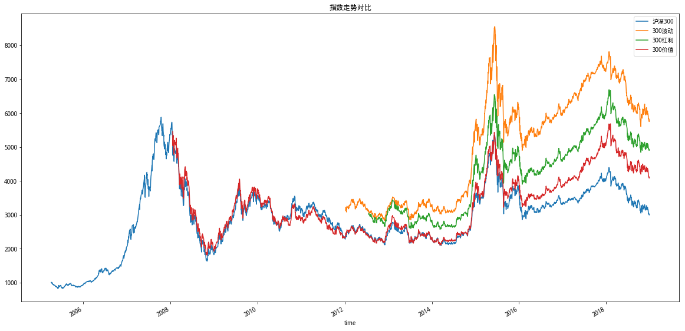

# 聚宽学习周记十一：

## 一、代码解释


## 二、上周计划任务

### 1.查找资料学习有关归一化和对数化的概念。

### 2.根据@Gyro的这篇文章写作一个简单的策略。

## 三、本周新学内容

### 1.沪深300相关指数

上周解读了@Gyro的[价值低波（中）-- 市盈率研究](https://www.joinquant.com/view/community/detail/328831058b45f5f1080914aaea6e0d09)，这周顺便看了下上篇：[价值低波（上）--因子加强](https://www.joinquant.com/view/community/detail/3b813a684c2360b412883737dba665d2?type=1)，里面提到了“价值因子、红利因子和低波因子”，对于“因子”这个专业术语本来预定第3周开始学习，但一来觉得这个术语听起来有点高级怕花费太多的时间，二来有在聚宽里学习碰到的其他一些更加低级的问题，所以一直拖到现在，这次算是和“因子”的正面交锋。

但我这次还是先不管它，因为在@Gyro文章里我发现对于沪深300相关指数的认识不够清楚，对于300能源、300材料、300工业等等按照行业来划分的指数我能够理解，但是下面这几个什么“波动”、“高贝”、“非周期”的到底怎么来制定的我感到很好奇。搜索之后发现这些指数都是中证系列的指数，从中可以找到它们的编制方案和成分股数据：

- [000300.XSHG/沪深300](http://www.csindex.com.cn/zh-CN/indices/index-detail/000300)：沪深300指数由上海和深圳证券市场中市值大、流动性好的300只股票组成，综合反映中国A股市场上市股票价格的整体表现。
- [000803.XSHG/300波动](http://www.csindex.com.cn/zh-CN/indices/index-detail/000803)：沪深300波动率加权指数以沪深300指数样本股中历史波动率最小的100只股票为成分股，采用历史波动率的倒数作为权重分配依据，以降低整个指数组合的波动率(风险)。
- [000821.XSHG/300红利](http://www.csindex.com.cn/zh-CN/indices/index-detail/000821)：沪深300红利指数以沪深300指数样本股中股息率最高的50只股票为成分股，采用股息率作为权重分配依据，以反映沪深300指数中高股息率股票的整体表现。
- [000828.XSHG/300高贝](http://www.csindex.com.cn/zh-CN/indices/index-detail/000828)：沪深300高贝塔指数以沪深300指数为样本空间，根据股票过去一年的贝塔值进行从高到低排名，选取排名靠前的股票作为样本股，并以样本股的贝塔值进行加权。高、低贝塔指数系列可以表征与全市场不同贝塔属性的股票价格变化。
- [000829.XSHG/300低贝](http://www.csindex.com.cn/zh-CN/indices/index-detail/000829)：沪深300低贝塔指数以沪深300指数样本股中贝塔值排名靠后的100只股票为成分股，采用贝塔值的倒数作为权重分配依据。
- [000843.XSHG/300动态](http://www.csindex.com.cn/zh-CN/indices/index-detail/000843)：沪深300动态指数以沪深300指数所有样本股为样本空间，通过波动率因子和质量因子计算敏感性评分，选取对宏观环境和经济周期变动具有较高风险敞口的150只股票构成。
- [000844.XSHG/300稳定](http://www.csindex.com.cn/zh-CN/indices/index-detail/000844)：沪深300稳定指数以沪深300指数所有样本股为样本空间，通过波动率因子和质量因子计算敏感性评分，选取对宏观环境和经济周期变动具有较低风险敞口的150只股票构成。
- [000918.XSHG/300成长](http://www.csindex.com.cn/zh-CN/indices/index-detail/000918)：沪深300成长指数以沪深300指数为样本空间，从中选取成长因子评分最高的100只股票作为样本股。
- [000919.XSHG/300价值](http://www.csindex.com.cn/zh-CN/indices/index-detail/000919)：沪深300价值指数以沪深300指数样本股中价值因子评分最高的100只股票为成分股，采用价值因子数值作为权重分配依据。
- [000968.XSHG/300周期](http://www.csindex.com.cn/zh-CN/indices/index-detail/000968)：沪深300周期行业指数以沪深300指数样本股为样本空间，选取归属金融保险、采掘、交通运输仓储、金属非金属、房地产等5个具有较强周期性特征行业的股票构成样本股。
- [000969.XSHG/300非周](http://www.csindex.com.cn/zh-CN/indices/index-detail/000969)：沪深300非周期行业指数以沪深300指数样本股为样本空间，选取金融保险、采掘、交通运输仓储、金属非金属、房地产以外行业的股票组成样本股。

在上面这些系列指数的解释中可以发现编制这些指数的时候也提到了各自专业术语，比如“贝塔值”、“波动率因子”、“质量因子”、“成长因子”等等，看来“因子”这个专业术语今天是绕不过去了。不过今天不扩展了解，就把上面这些指数里面出现的几个专业术语尝试着弄明白。

**1.波动率**

按照[中证波动率加权指数系列编制方案](http://www.csindex.com.cn/uploads/indices/detail/files/zh_CN/148_000803_Index_Methodology_cn.pdf)中描述，这里的波动率是计算的最近一年日收益率的标准差。标准差是数学上的一个专业术语，上学的时候学习过，但现在已经不记得了。在查找资料的过程中发现“[马同学高等数学](https://www.matongxue.com/)”课程讲解得不错，特意花了99元去买了其中的《概率与统计》课程来重新学习。对于这里标准差的解释大致如下：

- 标准差和方差是一对孪生兄弟，它们是用来评估随机变量的指标。比如，对于一些随机变量我们通常会想知道它的均值（也就是数学期望），有些时候我们还想知道它的大概范围（方差/标准差）。
- 最开始是使用方差来衡量随机变量的分布范围，但由于方差的计算中有平方的计算导致它的结果的单位是平方不便于比较。比如某班级里面学生的平均升高是1.62米，计算出来的方差是0.003平方米，我们就不好说`这个班级里学生的身高范围在1.62米正负0.003平方米的范围区间`。这个时候在方差基础上引入了标准差，直接对方差开平方让单位保持一致，0.003平方米开方的结果为0.054米，那么这个时候我们可以说`这个班级里学生的身高范围在1.62米正负0.054米的范围区间`。当然，我还没有明白为什么方差的定义要采用二阶矩的形式使得非要引入标准差进行修正。
- 标准差和方差尽管是一个数学概念，但同时在很多行业里面使用。比如抽象的数据集，方差/标准差大意味着数据的比较离散；概率论中方差大意味着概率质量函数的分布比较分散，随机性高；金融领域中方差大意味着波动大，风险高。

**2.贝塔值**

其实贝塔值在之前学习编写第一个策略时理解策略回测后的衡量指标的[聚宽学习第五周周记：中证指数共享函数使用更新与策略指标的理解](https://www.joinquant.com/view/community/detail/99a6ea4179cfa056552d3567b3387bc6)里就已经提到过了。这里引用过来：

> Beta用来描述投资过程中蕴含的系统风险。在量化里反映了策略收益对大盘变化的敏感性，也就是Beta反映了你的投资策略相对于整个市场的那部分相对收益。

所以这里的高贝。

注：@Gyro文中的“300低波”我并没有在聚宽的指数名单中找到，但当我把相关指数的趋势图画出来时，肉眼观察觉得文中的“300低波”就是中证指数的“300波动”指数。然而这里的一个疑问是“300波动”指数的编制方案是“将股票按照波动率指标由高到低进行排名，选择排名前100名的股票构成对应指数样本股，然后指数计算时的的权重分配与其历史波动率的倒数成正比。”也就是说“300波动”选择的是沪深300指数中按照波动率排名前100位的样本股，但“300低波”听起来像是选择波动率较低的样本股。



### 2.

上周想调查一下最近上市的股票的涨停天数具体是怎么样的，我当时的方案是获取最近一段时间上市的股票然后打开交易软件去数有几个涨停，但这样效率很低，并且不同板上市的数据会不一样。所以想着是否可以写个函数帮忙进行统计。

```
df = get_all_securities()
df = df[df['start_date'] > dt.date(2020, 2, 1)]
print(df)
```


## 四、下周学习任务
