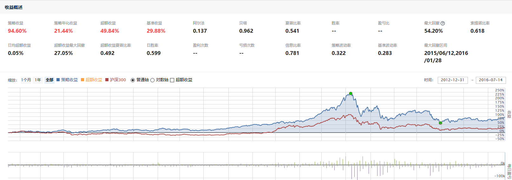
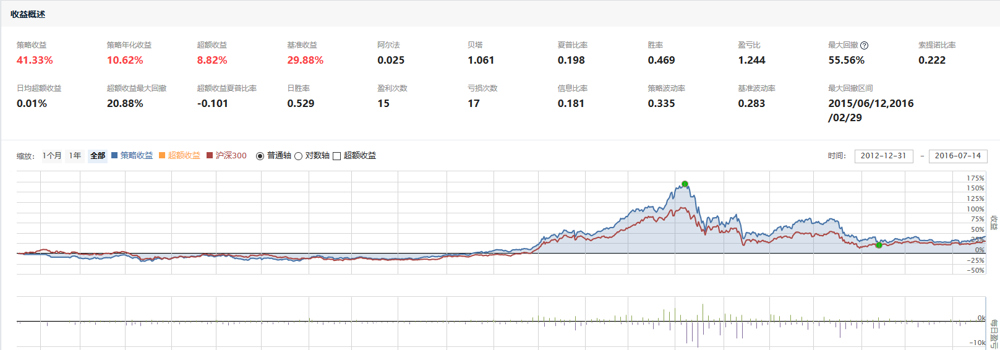
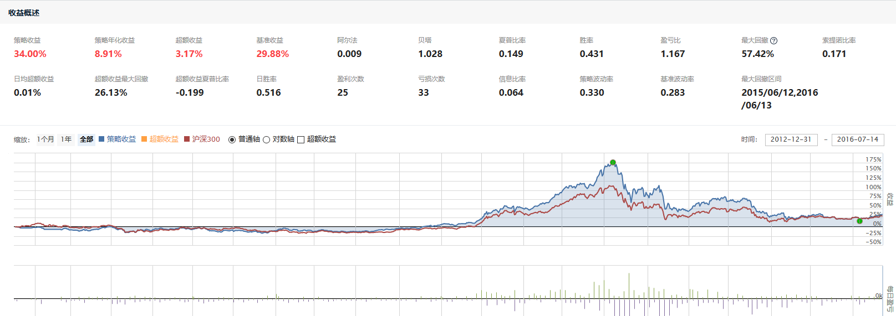
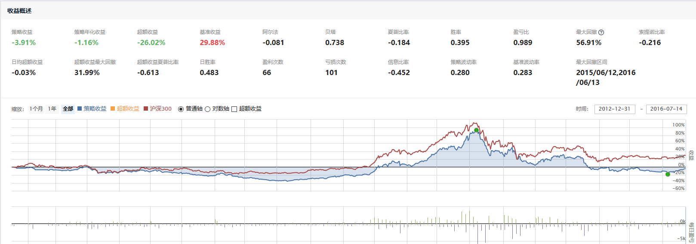

# 聚宽学习周记十四：详解@东南有大树的“ETF二八轮动对冲模型”（中）

## 一、代码解释

## 二、上周计划任务

### 1.按照[【量化课堂】斗牛蛋卷二八轮动原版策略实现](https://www.joinquant.com/view/community/detail/9434c4a9c9482c7d1071be947dd3558a?type=1)提到的思路对例子中的策略进行优化和对比。

**① 沪深300和中证500的对比**

首先是对比沪深300指数和中证500指数在走势上面的差异，可以写个简单策略来看它们之间的走势，比如我们设定“沪深300”为基准，那么只需要在开盘的时候直接买入“中证500指数”就可以了（聚宽当前支持指数交易），然后编译运行策略或者执行策略就可以看到这两个指数的走势图：

按照以前的经验，小市值的股票尽管盈利不稳定但是发展潜力大，所以波动较大市值股票更大。从走势图也可以看到代表着小市值企业的中证500指数相比代表大中市值企业的沪深300指数波动更大：行情走高的时候中证500涨幅更大，行情走低的时候中证500跌幅也更大。针对这种走势上的差异于是提出了优化策略—按周级别的简易二八轮动策略。

**② 按周交易的简易二八轮动策略**

每周五(或者本周的最后一个交易日)临近收盘时，计算沪深300指数和中证500指数在前1个交易日相比前20个交易日的涨幅。哪个涨幅大，那么就在收盘前买入对应的ETF持有一周，直至下一次的切换。

通过回测2013年1月1日——2016年7月14日的数据发现，以周为单位进行轮动获取到的收益实际上比单纯的中证500指数的收益还要低。可以说，这个策略是比较糟糕的。其中可能的原因包括：

- 按周进行交易无法捕捉到行情的快速变换，比如可能在5天之内已经下跌了很多；
- 同时如果中证500在5天之内快速上涨，那么由于按周交易当时持有沪深300就会错过快速的上涨。

所以在这简单的二八轮动策略上将按周交易改为按日交易。

**③ 按日交易的简易二八轮动策略**

将如上的策略从按周执行修改为按日执行之后发现回测的收益更低了，如下：

怎么回事？这是因为尽管从按周更改为按日执行后对于趋势的抓取更为敏感，所以它能够在抓取更大的涨幅。然而，在整个市场开始下跌的时候，由于仅仅在ETF300和ETF500之间轮动，因此并没有很好的止损，所以依然避免不了整体收益大幅折损的结果。

所以，我们要进一步优化：添加止损策略。

**④ 按日交易的简易二八轮动策略(带止损)**

止损策略的设计为：计算沪深300指数和中证500指数在前1个交易日相比前20个交易日的涨幅，如果检测到持仓证券对应的指数涨幅小于0的时候那么清空所持有的证券。直到检测到指数回升的时候再买入。

回测结果让人大跌眼镜：基准收益盈利29.88%，策略收益亏损3.91%。为什么？因为证券轮换得太过频繁了。

**⑤ 按日交易的简易二八轮动策略(带止损，降低频率)**

我们基于如上策略基础之上再做一次优化：

- 计算沪深300指数和中证500指数在前1个交易日相比前20个交易日的涨幅，如果检测到持仓证券对应的指数涨幅小于0的时候，清空所持有的证券。
- 计算沪深300指数和中证500指数在前1个交易日相比前20个交易日的涨幅，如果检测到持仓证券对应的指数涨幅大于0的时候，购买涨幅较大的那个指数对应的证券。
- 其他情况择持有证券不动。
  - 沪深300指数和中证500指数涨幅均小于0，说明处于下跌通道。
  - 已经持仓证券，也持有不动，直到对应证券涨幅小于0卖出。

执行的回测结果如下：

这也是我们上周“代码解释”部分详解的策略，也就是[【量化课堂】斗牛蛋卷二八轮动原版策略实现](https://www.joinquant.com/view/community/detail/9434c4a9c9482c7d1071be947dd3558a?type=1)后面附带的策略。

**⑥ 按日交易的简易二八轮动策略(带止损，降低频率，国债)**

我们在上面的基础之上再进行优化，也就是当沪深300和中证500指数均下跌的时候不是保持空仓，而是购买“国债”，这也就是[【量化课堂】斗牛蛋卷二八轮动原版策略实现](https://www.joinquant.com/view/community/detail/9434c4a9c9482c7d1071be947dd3558a?type=1)里面描述的“蛋卷二八轮动策略”的思路。

策略里面指数下跌的时候购买的是国债指数`000012.XSHG`，但看2013年1月1日——2016年7月14日这段时间的回测结果它的表现也没有强多少。

不过当前按日级别交易的策略即便在2013年1月1日——2016年7月14日这段时间的回测可以获取到200%多的收益，但是在2018年1月1日——2020年3月30日的回测结果却是-30%左右的收益，大大低于沪深300指数。

其他的优化可以通过调整参数，比如将“指数收益率涨幅小于0”修改为“指数收益率涨幅小于5%”来进行交易的判断等方式可以优化回测的结果。但是，其实我们是很难保证这种优化是否能够适应于未来的行情变化。所以，针对[【量化课堂】斗牛蛋卷二八轮动原版策略实现](https://www.joinquant.com/view/community/detail/9434c4a9c9482c7d1071be947dd3558a?type=1)里面描述的“蛋卷二八轮动策略”的理解和练习就先到这里了。

### 2.理解[用指数战胜指数，ETF二八轮动对冲模型](https://www.joinquant.com/view/community/detail/19490)中讲解的内容。

上面是我在阅读[【量化课堂】斗牛蛋卷二八轮动原版策略实现](https://www.joinquant.com/view/community/detail/9434c4a9c9482c7d1071be947dd3558a?type=1)时候所做的一些理解和尝试，最终差不多理解了整体的思路，但觉得该策略依然具有不稳定性。

于是回过头去阅读@江南有大树的这篇[用指数战胜指数，ETF二八轮动对冲模型](https://www.joinquant.com/view/community/detail/19490)的时候，当时觉得挺难理解的内容，现在一下子清晰了许多。大树的目的其实也是看到了“蛋卷二八轮动”在熊市时具有的较大波动，提出了一种新的思路，即通过找到另外与沪深300/中证500走势相反的指数ETF来进行对冲。

### 3.偶然在[银行股的配对交易策略研究](https://www.joinquant.com/view/community/detail/b80e9e60d6f39fa6c8e3b4cb3af4a07f?page=1#90895)的评论中发现银行股的波动小，那么如何选择出证券市场波动最大和最小的行业呢？

## 三、本周新学内容

## 四、下周学习任务
