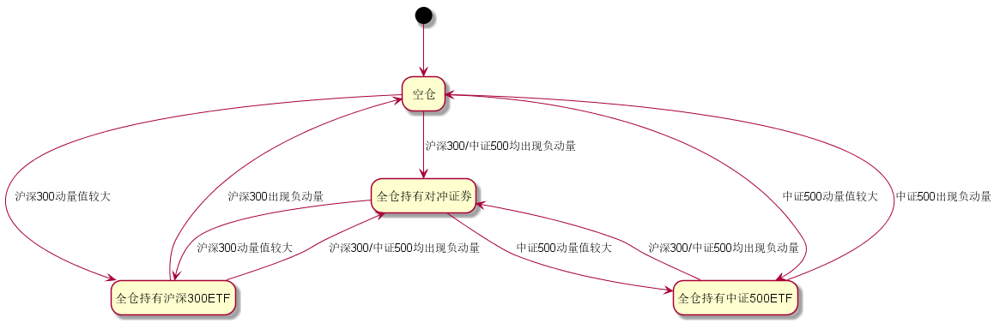

# 聚宽学习周记十五：详解@东南有大树的“ETF二八轮动对冲模型”（下）

本周终于可以结束@东南有大树[用指数战胜指数，ETF二八轮动对冲模型](https://www.joinquant.com/view/community/detail/19490)这篇文章的学习了，前面两周已经先后学习了文章里面提到的“蛋卷二八轮动策略”，大树兄的研究笔记，现在轮到对他文章里面的策略一探究竟了。

## 一、代码解释

```
# 导入函数库
import numpy as np
import pandas as pd
import datetime
from jqdata import *

# 初始化函数，设定基准等等
def initialize(context):
    # 设置模型参数
    set_parms()
    # 设定沪深300作为基准
    set_benchmark('000300.XSHG')
    # 开启动态复权模式(真实价格)
    set_option('use_real_price', True)
    # 过滤掉order系列API产生的比error级别低的log
    log.set_level('order', 'error')
    # 股票类每笔交易时的手续费是：买入时佣金万分之三，卖出时佣金万分之三加千分之一印花税, 每笔交易佣金最低扣5块钱
    set_order_cost(OrderCost(close_tax=0.001, open_commission=0.0003, close_commission=0.0003, min_commission=5), type='stock')
    # 运行
    run_daily(market_trade, time='14:53', reference_security='000300.XSHG')
    log.info('-----------------程序开始-------------------')

# 设置参数
def set_parms():
    g.cycle = 20  # 设置计算动量的周期
    g.index_list = ['000300.XSHG', '000905.XSHG']  # 指数列表
    g.etf_list = ['510300.XSHG', '510500.XSHG']  # ETF列表
    g.bond = '150051.XSHE'  # 负相关品种
    # g.bond = '511010.XSHG'  # 国债ETF
    g.ratio = 0.00  # 动量正值最小幅度

# 开盘前运行
def before_trading_start(context):
    # 将滑点设置为0
    set_slippage(FixedSlippage(0))
    # 根据不同的时间段设置手续费
    dt=context.current_dt
    if dt>datetime.datetime(2013,1, 1):
        set_commission(PerTrade(buy_cost=0.0003, sell_cost=0.0013, min_cost=5))
    elif dt>datetime.datetime(2011,1, 1):
        set_commission(PerTrade(buy_cost=0.001, sell_cost=0.002, min_cost=5))
    elif dt>datetime.datetime(2009,1, 1):
        set_commission(PerTrade(buy_cost=0.002, sell_cost=0.003, min_cost=5))
    else:
        set_commission(PerTrade(buy_cost=0.003, sell_cost=0.004, min_cost=5))

## 收盘之前运行
def market_trade(context):
    signal = get_signal(context)
    log.info('信号', signal)
    if signal == 'clear' and len(context.portfolio.positions) > 0:
        for etf in context.portfolio.positions.keys():
            order_target_value(etf, 0)
            log.info('卖出', get_security_info(etf).display_name)
    elif (signal in g.etf_list):
        if g.bond in context.portfolio.positions.keys():
            order_target_value(g.bond, 0)
            log.info('卖出', get_security_info(g.bond).display_name)
        order_value(signal, context.portfolio.cash)
        log.info('买入', get_security_info(signal).display_name)
    elif signal == g.bond:
        for etf in context.portfolio.positions.keys():
            order_target_value(etf, 0)
            log.info('卖出', get_security_info(etf).display_name)
        order_value(g.bond, context.portfolio.cash)
        log.info('买入', get_security_info(g.bond).display_name)


# 获取交易信号
def get_signal(context):
    hold = context.portfolio.positions.keys()
    # 计算全部标的的动量值
    power_df = pd.DataFrame({e: {'power': get_power(i, g.cycle)}\
        for i, e in zip(g.index_list, g.etf_list)}).T
    # 判断是否需要买入国债
    if g.bond not in hold and False not in [True if power_df.loc[i, 'power'] <= 0 else False for i in power_df.index]:
        return g.bond
    # 判断持仓标的是否出现负动量
    elif [i for i in power_df.index if i in hold and power_df.loc[i, 'power'] <= 0] and g.bond not in hold:
        return 'clear'
    # 判断哪个标的的动量值大于0，选择最大的
    elif power_df.sort_index(by=['power'])['power'][-1] > g.ratio and len(set(g.etf_list) & set(hold)) <= 0:
        return power_df.sort_index(by=['power']).index[-1]


# 计算动量值
def get_power(stock, interval=20):
    h = attribute_history(stock, interval, unit='1d', fields=('close'), skip_paused=True)
    return (h['close'].values[-1] - h['close'].values[0]) / h['close'].values[0]

# 收盘后运行
def after_trading_end(context):
    log.info('*'*50)
```

这个执行策略的收益情况如下：


我在看@江南有大树的策略之前自己按照前面学习到的思路按照“蛋卷二八轮动”策略改写了一个包含负动量对冲的策略，结果收益远不如大树兄的，特别是2018年的整体走势大树兄的策略能够完美平抑市场行情的波动，但我的这个策略对冲依然没有奏效。所以也希望在我在解释完大树兄的这篇策略之后可以发现我改写的策略问题出在什么地方。


对于策略的解释依然按照逻辑功能进行划分，分为"import"系列语句、策略初始化、开盘前的运算、盘中的决策。

**"import"系列语句**

```
import numpy as np
import pandas as pd
import datetime
from jqdata import *
```

聚宽的研究环境和策略执行坏境都是基于python的，所以我们在写研究/策略中除了要学会python的基本语法和常用数据结构外，还需要使用python的第三方函数库、甚至聚宽自定义的python函数库。上面被import进来的函数库分别提供不同的功能，它们在[聚宽学习周记十：详解“价值低波（中）-- 市盈率研究”](https://www.joinquant.com/view/community/detail/4f9db6cbc7075f4577229e1b21d70661)已经提到过，摘录如下：

- numpy: Numberical Python的简称，是Python科学计算的基础模块，提供快速的数组处理能力。
- pandas：基于numpy之上构建，除了具有NumPy高性能的数组计算功能，还具有便捷地处理结构化数据如电子表格、关系型数据库数据的功能。
- datetime：Python用来处理日期和时间的专用模块。

至于`jqdata`是聚宽编写的python模块用来支持数据访问服务，比如多个标的在指定日期范围内的市值表数据的`get_valuation()`，获取交易日的`get_trade_days `，以及在使用聚源服务的时候都需要。由于聚宽的研究和策略执行环境里面本身已经导入了一些聚宽服务函数，其实`from jqdata import *`在这里并不是必须的。

**策略初始化**

```
# 初始化函数，设定基准等等
def initialize(context):
    # 设置模型参数
    set_parms()
    # 设定沪深300作为基准
    set_benchmark('000300.XSHG')
    # 开启动态复权模式(真实价格)
    set_option('use_real_price', True)
    # 过滤掉order系列API产生的比error级别低的log
    log.set_level('order', 'error')
    # 股票类每笔交易时的手续费是：买入时佣金万分之三，卖出时佣金万分之三加千分之一印花税, 每笔交易佣金最低扣5块钱
    set_order_cost(OrderCost(close_tax=0.001, open_commission=0.0003, close_commission=0.0003, min_commission=5), type='stock')
    # 运行
    run_daily(market_trade, time='14:53', reference_security='000300.XSHG')
    log.info('-----------------程序开始-------------------')

# 设置参数
def set_parms():
    g.cycle = 20  # 设置计算动量的周期
    g.index_list = ['000300.XSHG', '000905.XSHG']  # 指数列表
    g.etf_list = ['510300.XSHG', '510500.XSHG']  # ETF列表
    g.bond = '150051.XSHE'  # 负相关品种
    # g.bond = '511010.XSHG'  # 国债ETF
    g.ratio = 0.00  # 动量正值最小幅度
```

策略的初始化和整体框架在[聚宽学习周记十三：详解@东南有大树的“ETF二八轮动”（上）](https://www.joinquant.com/view/community/detail/6368970bcee10f14e331103443e38587)里面解析“蛋卷二八轮动原版策略实现”的时候已经比较详细的介绍过了，这里再跳重点说说。

聚宽的策略主要由“策略初始化函数”和“周期性执行函数”组成，前者用来完成策略运行时候一些基本参数的设置，后者用来定义周期性执行的处理过程。

- “策略初始化函数”只有一个，就是`initialize(context)`，这个函数会在策略启动的时候被系统最先调用，所以你不能改名字，只能够在里面添加初始化的内容。
- “周期性执行函数”有三个，分别对应盘前、盘中和盘后执行，但是它们有两组：
  - 1. 第一组是系统默认支持的可以按日、分钟、Tick执行的`before_trading_start/handle_data/after_trading_end`，它们的名字也不能改，你可以通过在网页上选择要执行的频率。
  - 2. 另一组是通过`run_daily/run_weekly/run_monthly`在策略初始化的时候设定的按日、周和月频率执行的函数，通过这组函数来注册的周期执行函数是可以随便命名的。

在上面的策略初始化里面主要设置了业绩基准、复权模式、手续费、按日执行的策略函数以及策略中会使用的全局变量。

**开盘前的运算**

```
def before_trading_start(context):
    # 将滑点设置为0
    set_slippage(FixedSlippage(0))
    # 根据不同的时间段设置手续费
    dt=context.current_dt
    if dt>datetime.datetime(2013,1, 1):
        set_commission(PerTrade(buy_cost=0.0003, sell_cost=0.0013, min_cost=5))
    elif dt>datetime.datetime(2011,1, 1):
        set_commission(PerTrade(buy_cost=0.001, sell_cost=0.002, min_cost=5))
    elif dt>datetime.datetime(2009,1, 1):
        set_commission(PerTrade(buy_cost=0.002, sell_cost=0.003, min_cost=5))
    else:
        set_commission(PerTrade(buy_cost=0.003, sell_cost=0.004, min_cost=5))
```

函数`before_trading_start`是按日、分钟、Tick模式下（注意如果是按日执行的时候使用这个函数那么就不需要用使用`run_daily`来注册按日执行的盘前执行函数）系统默认在开盘前调用的函数，这里它的功能是用来为不同的日期区间设置手续费。

滑点这个东东我最初觉得关系不大，但实际上它的设置对整个策略回测所能够产生的影响是不小的，这一点在后面再讨论。

**盘中的决策**

```
def market_trade(context):
    signal = get_signal(context)
    log.info('信号', signal)
    if signal == 'clear' and len(context.portfolio.positions) > 0:
        for etf in context.portfolio.positions.keys():
            order_target_value(etf, 0)
            log.info('卖出', get_security_info(etf).display_name)
    elif (signal in g.etf_list):
        if g.bond in context.portfolio.positions.keys():
            order_target_value(g.bond, 0)
            log.info('卖出', get_security_info(g.bond).display_name)
        order_value(signal, context.portfolio.cash)
        log.info('买入', get_security_info(signal).display_name)
    elif signal == g.bond:
        for etf in context.portfolio.positions.keys():
            order_target_value(etf, 0)
            log.info('卖出', get_security_info(etf).display_name)
        order_value(g.bond, context.portfolio.cash)
        log.info('买入', get_security_info(g.bond).display_name)


# 获取交易信号
def get_signal(context):
    hold = context.portfolio.positions.keys()
    # 计算全部标的的动量值
    power_df = pd.DataFrame({e: {'power': get_power(i, g.cycle)}\
        for i, e in zip(g.index_list, g.etf_list)}).T
    # 判断是否需要买入国债
    if g.bond not in hold and False not in [True if power_df.loc[i, 'power'] <= 0 else False for i in power_df.index]:
        return g.bond
    # 判断持仓标的是否出现负动量
    elif [i for i in power_df.index if i in hold and power_df.loc[i, 'power'] <= 0] and g.bond not in hold:
        return 'clear'
    # 判断哪个标的的动量值大于0，选择最大的
    elif power_df.sort_index(by=['power'])['power'][-1] > g.ratio and len(set(g.etf_list) & set(hold)) <= 0:
        return power_df.sort_index(by=['power']).index[-1]


# 计算动量值
def get_power(stock, interval=20):
    h = attribute_history(stock, interval, unit='1d', fields=('close'), skip_paused=True)
    return (h['close'].values[-1] - h['close'].values[0]) / h['close'].values[0]
```

这部分代码是主要的交易策略代码，再按照这三个函数分别进行解释。

1. `get_power()`

按照注释，这个函数用来计算动量值。动量听起来很专业，因为它是物理学里面的专有名词。而这里我们的动量相对来说比较简单，其实计算的是股价的涨幅，比如代码里面计算的就是上一个交易日的收盘价相对于前第20个交易日的收盘价的涨跌幅度。

2. `get_signal()`

获取交易信号，即是结合当前的持仓情况和计算的动量值来决定本交易日该如何进行证券的买卖。我发现@江南有大树这个python用得贼溜了，比如`pd.DataFrame({e: {'power': get_power(i, g.cycle)} for i, e in zip(g.index_list, g.etf_list)}).T`这一句python新手一般很难写得出来，我也学了一段时间的python了，但一时也没有完全理解。尽管上周刚学了“字典解析式”，但这里又搞了一个`zip`，搜索了一下这个`zip()`函数的功能是将两个列表一一对应的元素打包成元组，然后再返回成列表。

```
g.index_list = ['000300.XSHG', '000905.XSHG']  # 指数列表
g.etf_list = ['510300.XSHG', '510500.XSHG']  # ETF列表
zip(g.index_list, g.etf_list)

返回的结果为：

[('000300.XSHG', '510300.XSHG'), ('000905.XSHG', '510500.XSHG')]
```

这个看明白之后又遇到了另外一个变形金刚`if g.bond not in hold and False not in [True if power_df.loc[i, 'power'] <= 0 else False for i in power_df.index]`，我歪着头看了老半天，也算第一次感受到python的霸气：一行代码可以写这么长！

这行代码先在`and`那里砍一刀，变成`if g.bond not in hold`和`False not in [True if power_df.loc[i, 'power'] <= 0 else False for i in power_df.index]`，and前面那句很好理解就是判断当前持仓是否有g.bond，后面那一句太长了所以我进行了如下转换来帮助理解：

```
False not in [True if power_df.loc[i, 'power'] <= 0 else False for i in power_df.index]

ret = []
for i in power_df.index:
  if power_df.loc[i, 'power'] <= 0:
    ret.append(True)
  else:
    ret.append(False)

False not in ret    
```

也就是说后半句判断沪深300和中证500指数是否都出现了负动量的情况。所以整个判断的意思是如果“当前持仓中没有对冲标的g.bond”并且“沪深300和中证500均出现了负动量”，那么建议“买入对冲标的g.bond”。

上面这种复杂句式搞懂了之后就可以比较容易的弄明白`[i for i in power_df.index if i in hold and power_df.loc[i, 'power'] <= 0] and g.bond not in hold`这句话的意思是如果“当前持有沪深300ETF/中证500ETF并且检测到对应的指数出现负动量”，同时也没有持有对冲标的g.bond的时候那么建议“卖出持有的沪深300ETF/中证500ETF”。

最后一个判断分支`power_df.sort_index(by=['power'])['power'][-1] > g.ratio and len(set(g.etf_list) & set(hold)) <= 0`的意思是如果“沪深300/中证500指数中较大的一个动量大于我们确定的阈值”，并且“当前的持仓里面没有持有沪深300/中证500的ETF”，那么建议“买入动量较大指数对应的ETF”。

总结一下如上的交易策略：

- 持仓没有“对冲标的g.bond”并且“沪深300和中证500均出现了负动量”，那么建议“买入对冲标的g.bond”
  - 此时的可能持仓：1，持有沪深300/中证500ETF；2，空仓时。
- 持有“沪深300ETF/中证500ETF”并且检测到对应的指数出现负动量，建议“clear”。
- “沪深300/中证500指数”中较大的一个动量大于我们确定的阈值，并且当前的持仓里面没有持有“沪深300/中证500的ETF”，那么建议“买入动量较大指数对应的ETF”
  - 此时的可能持仓：1，持有对冲标的g.bond；2，空仓时。

3. `market_trade()`

在函数`market_trade()`里就是根据上面获得的交易信号进行交易：

- 信号是"clear"，那么卖出所有持仓证券
- 信号是“买入沪深300ETF/中证500ETF”，那么先清空当前的持仓，再买入建议的证券
- 信号是“买入对冲ETF”，那么先清空当前的持仓，再买入建议的证券


## 二、上周计划任务

### 1.完成对[用指数战胜指数，ETF二八轮动对冲模型](https://www.joinquant.com/view/community/detail/19490)里面的策略的解析。

上面第一部分是解析大树兄在文章里面写作的策略，前面提到我自己也按照大树兄的思路写了一个策略但是执行的结果相差比较大：

大树兄的策略在2013-05-01~2019-04-11收益率可以高达417.57%：


但我自己写的策略在这段时间内收益率仅仅只有252.63%：


所以我的策略在算法上肯定和大树兄的有不一样的地方。为了找到它们之间的差别，我只能在读完大树兄的策略后将它的算法以状态机的形式画出来：



回顾自己之前写的策略，里面的算法如下：

- 持有沪深300/中证500对应的ETF，且检测到对应指数动量小于0，建议“卖出持仓ETF再买入对冲证券”
- 持有沪深300/中证500对应的ETF，持仓不动。此时“持仓ETF对应指数动量为正”
- 检测到动量都小于0，持仓不动。此时“可能空仓”或“持有对冲证券”
- 其他情况：买入“动量较大的指数对应的ETF”，这些情况包括：
  - 空仓/持有对冲ETF的时候，有指数的动量由负转正

对应如下的状态转换：


对比之下不同的有两种场景：

- 1.在持有沪深300/中证500ETF的时候如果发现对应指数出现负动量，此时会直接买入对冲证券。下一个交易日再切换到沪深300/中证500ETF或者保持不动，而原作中是先切换到空仓再选择，有些差别但是差异不大。
- 2.也就是当策略启动的时候检查到沪深300/中证500的动量都小于0的时候，这个时候会保持空仓，不会持有对冲ETF。

整体上看，上面我写的策略里面是当策略开始执行后策略永远都是满仓的，整个执行区间不会再回到空仓的状态。将上面两种不同修正之后经过测试，发现引起策略测试回测结果差别较大的另外两个因素：“频繁调仓”和“滑点设置”。

**频繁调仓**

在修正之后的策略里面，对于检测到沪深300/中证500指数均出现负动量时的交易信号为“买入对冲证券”，所以这个时候即便之前已经持有了对冲证券，这个时候依然会先卖出再买入，白交了一笔手续费，导致收益率从“417.57%”下降到“296.05%”。

**滑点设置**

我在策略中最开始没有设置滑点，也就是策略会使用默认滑点，此时的收益率为“302.85”，但如果使用固定滑点0那么收益率为“417.57%”。

### 2.偶然在[银行股的配对交易策略研究](https://www.joinquant.com/view/community/detail/b80e9e60d6f39fa6c8e3b4cb3af4a07f?page=1#90895)的评论中发现银行股的波动小，那么如何选择出证券市场波动最大和最小的行业呢？

波动率这个指标，在[聚宽学习周记十一：沪深300相关指数与一个简单的策略](https://www.joinquant.com/view/community/detail/6f4ec5802b1710be8e39248afec64a64)里面提到过，它实际上是指的收盘价在一段时间内的标准差。比如中证波动率加权指数系列是以对应母指数为样本空间，选取历史波动率最小的100只股票作为样本股，其中指数成分股的波动率便是计算每支样本股最近一年日收益率的波动率（标准差）。

弄清楚“波动率”这个概念之后，其实选择证券市场波动率最大和最小的行业的基本思路也就有了，只要能够找到代表行业的行情走势就能够计算它们各自的标准差了。

按照这个思路在策略研究里面拟出了一个统计草稿，执行结果如下：

```
name start_date       标准差/波动
801215    其他休闲服务II 2014-02-21    48.108212
801211        餐饮II 2005-05-27    84.311090
801112      视听器材II 2005-05-27   102.062213
801055      工业金属II 2014-02-21   103.914450
801194        保险II 2007-01-18   105.363647
801023      石油开采II 2005-05-26   109.293707
801081       半导体II 2005-05-27   115.756126
801084     光学光电子II 2005-05-27   118.769392
801015        渔业II 2005-05-26   126.444117
801881    其他交运设备II 2014-02-21   131.027861
801162   环保工程及服务II 2005-05-27   133.800658
801092      汽车服务II 2005-05-27   141.728312
801205    商业物业经营II 2014-02-21   142.081313
801017      畜禽养殖II 2011-09-23   142.292974
801102      通信设备II 2005-05-27   147.677749
801724      专业工程II 2014-02-21   159.869844
801016       种植业II 2005-05-26   167.464660
801013      农业综合II 2005-05-26   170.203773
801177      铁路运输II 2005-05-27   172.148464
801011        林业II 2005-05-26   179.463110
801083        元件II 2005-05-27   181.391032
801752     互联网传媒II 2014-02-21   181.674526
801101     计算机设备II 2005-05-27   183.102935
801033      化学原料II 2005-05-26   185.632939
801175      高速公路II 2005-05-27   191.430471
801014        饲料II 2005-05-26   192.077193
801182      园区开发II 2005-05-27   192.227764
801142      家用轻工II 2005-05-27   193.736163
801231        综合II 2005-05-27   195.357993
801012     农产品加工II 2005-05-26   195.431414
801022      其他采掘II 2005-05-26   201.835449
801131      纺织制造II 2005-05-27   206.499109
801143        造纸II 2005-05-27   213.524966
801192        银行II 2005-05-27   214.179816
801721      房屋建设II 2014-02-21   217.457941
801144    其他轻工制造II 2014-02-21   221.774450
801711      水泥制造II 2014-02-21   225.410644
801132      服装家纺II 2005-05-27   226.584159
801161        电力II 2005-05-27   236.839338
801036        塑料II 2005-05-27   242.595099
801032      化学纤维II 2005-05-26   243.102924
801214      旅游综合II 2005-05-27   244.485703
801213        酒店II 2005-05-27   246.126965
801141      包装印刷II 2005-05-27   248.775056
801191      多元金融II 2005-05-27   252.612633
801085      电子制造II 2011-09-23   259.501261
801075      金属制品II 2008-06-26   263.004767
801723      基础建设II 2014-02-21   263.248045
801051  金属非金属新材料II 2005-05-27   265.287027
801223      通信运营II 2005-05-27   271.490090
801164        水务II 2005-05-27   273.453295
801034      化学制品II 2005-05-26   288.604514
801073      仪器仪表II 2005-05-27   293.627850
801174        机场II 2005-05-27   296.481348
801093     汽车零部件II 2005-05-27   298.484914
801203      一般零售II 2014-02-21   304.708476
801072      通用机械II 2005-05-27   305.503590
801152      生物制品II 2005-05-27   312.014119
801037        橡胶II 2005-05-27   319.257437
801082      其他电子II 2005-05-27   320.980741
801172        公交II 2005-05-27   321.561250
801156      医疗服务II 2007-07-04   324.994540
801154      医药商业II 2005-05-27   341.092078
801744      船舶制造II 2014-02-21   342.205341
801761      文化传媒II 2014-02-21   343.538883
801163        燃气II 2005-05-27   349.326827
801094      汽车整车II 2005-05-27   358.080069
801155        中药II 2005-05-27   359.777079
801151      化学制药II 2005-05-27   367.699772
801171        港口II 2005-05-27   381.067810
801713      其他建材II 2014-02-21   383.417975
801053        黄金II 2014-02-21   390.111954
801035      石油化工II 2005-05-26   398.084804
801153      医疗器械II 2005-05-27   412.496061
801712      玻璃制造II 2014-02-21   421.734366
801222     计算机应用II 2005-05-27   436.454607
801123      饮料制造II 2005-05-27   439.723291
801018      动物保健II 2011-09-23   446.147151
801181     房地产开发II 2005-05-27   452.098747
801176        航运II 2005-05-27   453.094921
801732   电气自动化设备II 2014-02-21   453.921723
801751      营销传播II 2014-02-21   454.239760
801124      食品加工II 2011-09-23   457.419086
801202        贸易II 2005-05-27   462.357419
801731        电机II 2014-02-21   472.441246
801024      采掘服务II 2011-09-23   474.227256
801173      航空运输II 2005-05-27   477.823095
801734     高低压设备II 2014-02-21   479.848148
801041        钢铁II 2005-05-27   483.429077
801074      专用设备II 2005-05-27   484.077330
801178        物流II 2005-05-27   569.664005
801111      白色家电II 2005-05-27   570.902775
801021      煤炭开采II 2005-05-26   603.970247
801733      电源设备II 2014-02-21   661.983661
801054      稀有金属II 2014-02-21   664.183555
801212        景点II 2005-05-27   708.978249
801742      航空装备II 2014-02-21   735.559558
801741      航天装备II 2014-02-21   743.477315
801193        证券II 2005-05-27   809.778017
801725      园林工程II 2014-02-21   834.876202
801204      专业零售II 2014-02-21   902.548405
801722      装修装饰II 2014-02-21   949.112353
801743      地面兵装II 2014-02-21  1194.857433
801076      运输设备II 2014-02-21  2166.619913
```

这个结果得出的计算步骤为：

- 获取申万二级行业从成立以来的日行情
- 以年为单位计算每个行业的标准差/波动（按照250个交易日进行计算）
- 然后再基于每年的标准差/波动计算各个年度行情的标准差/波动

从如上结果里面可以看到银行业的波动确实排在前列，但似乎看起来并不是波动最低的，比如保险似乎比银行业波动更低一些。我数学不好，上面的算法不一定准确，仅供参考。


## 三、本周新学内容

本周在执行@东南有大树的策略的时候，发现一个问题：滑点的设置对最终收益的影响不小。比如大树兄的策略里面设置`set_slippage(FixedSlippage(0)) `，也即滑点设置为0，得到的回测结果为：


我最开始没有设置滑点，从聚宽API文档里面可知如果没有设置滑点，那么系统默认的滑点是`PriceRelatedSlippage(0.00246)`，得到的回测结果为：


所以没想到滑点的设置会造成收益相差幅度达到了100%。那么滑点是什么？

滑点用来确定真实的成交价格与下单时预期的价格之间的偏差，有两种类型：

- 固定值： 这个价差可以是一个固定的值(比如0.02元, 交易时加减0.01元), 设定方式为`FixedSlippage(0.02)`。
- 百分比： 这个价差可以是是当时价格的一个百分比(比如0.2%, 交易时加减当时价格的0.1%), 设定方式为`PriceRelatedSlippage(0.002)`。


## 四、下周学习任务

目前已经学习了[聚宽2019年度评选+精选文章合集](https://www.joinquant.com/view/community/detail/5fea4e17fa8ad5eb32b85201375e2669?type=1)中的以下两篇精彩文章：

- @Gyro兄的[价值低波（中）-- 市盈率研究](https://www.joinquant.com/view/community/detail/328831058b45f5f1080914aaea6e0d09)
- @东南有大树兄的[用指数战胜指数，ETF二八轮动对冲模型](https://www.joinquant.com/view/community/detail/19490)

学习到了“波动”、“指数市盈率”、“大中小盘股”、“指数ETF轮动”、“动量”等概念，因此决定趁热打铁，下周的学习依然围绕着这些新接触的概念开展，和这些概念相关的有如下几篇：

- [相信波动率还是相信基本面？波动与估值因子A股驱动力测试](https://www.joinquant.com/view/community/detail/17255)
- [小盘价值股策略2.01，年化131%，回撤8.8%](https://www.joinquant.com/view/community/detail/16755)
- [高频因子探索——动量交易](https://www.joinquant.com/view/community/detail/22472)
- [指数估值自动报表系统——源代码](https://www.joinquant.com/view/community/detail/20497)
- [波动率因子在A股市场探索](https://www.joinquant.com/view/community/detail/2c6ae14a9e675394762eb24061e6207c)

考虑到这一个月也仿着写了两个练习策略，按照学以致用的学习原则，决定选择[指数估值自动报表系统——源代码](https://www.joinquant.com/view/community/detail/20497)。
