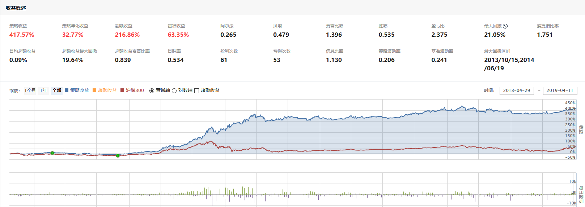
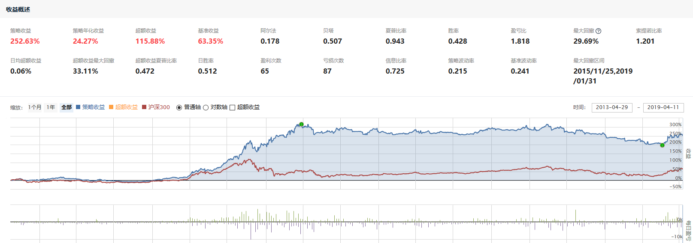

# 聚宽学习周记十五：详解@东南有大树的“ETF二八轮动对冲模型”（下）

本周终于可以结束@东南有大树[用指数战胜指数，ETF二八轮动对冲模型](https://www.joinquant.com/view/community/detail/19490)这篇文章的学习了，前面两周已经先后学习了文章里面提到的“蛋卷二八轮动策略”，大树兄的研究笔记，现在轮到对文章里面的策略一探究竟了。

## 一、代码解释

```
# 导入函数库
import numpy as np
import pandas as pd
import datetime
from jqdata import *

# 初始化函数，设定基准等等
def initialize(context):
    # 设置模型参数
    set_parms()
    # 设定沪深300作为基准
    set_benchmark('000300.XSHG')
    # 开启动态复权模式(真实价格)
    set_option('use_real_price', True)
    # 过滤掉order系列API产生的比error级别低的log
    log.set_level('order', 'error')
    # 股票类每笔交易时的手续费是：买入时佣金万分之三，卖出时佣金万分之三加千分之一印花税, 每笔交易佣金最低扣5块钱
    set_order_cost(OrderCost(close_tax=0.001, open_commission=0.0003, close_commission=0.0003, min_commission=5), type='stock')
    # 运行
    run_daily(market_trade, time='14:53', reference_security='000300.XSHG')
    log.info('-----------------程序开始-------------------')

# 设置参数
def set_parms():
    g.cycle = 20  # 设置计算动量的周期
    g.index_list = ['000300.XSHG', '000905.XSHG']  # 指数列表
    g.etf_list = ['510300.XSHG', '510500.XSHG']  # ETF列表
    g.bond = '150051.XSHE'  # 负相关品种
    # g.bond = '511010.XSHG'  # 国债ETF
    g.ratio = 0.00  # 动量正值最小幅度

# 开盘前运行
def before_trading_start(context):
    # 将滑点设置为0
    set_slippage(FixedSlippage(0))
    # 根据不同的时间段设置手续费
    dt=context.current_dt
    if dt>datetime.datetime(2013,1, 1):
        set_commission(PerTrade(buy_cost=0.0003, sell_cost=0.0013, min_cost=5))
    elif dt>datetime.datetime(2011,1, 1):
        set_commission(PerTrade(buy_cost=0.001, sell_cost=0.002, min_cost=5))
    elif dt>datetime.datetime(2009,1, 1):
        set_commission(PerTrade(buy_cost=0.002, sell_cost=0.003, min_cost=5))
    else:
        set_commission(PerTrade(buy_cost=0.003, sell_cost=0.004, min_cost=5))

## 收盘之前运行
def market_trade(context):
    signal = get_signal(context)
    log.info('信号', signal)
    if signal == 'clear' and len(context.portfolio.positions) > 0:
        for etf in context.portfolio.positions.keys():
            order_target_value(etf, 0)
            log.info('卖出', get_security_info(etf).display_name)
    elif (signal in g.etf_list):
        if g.bond in context.portfolio.positions.keys():
            order_target_value(g.bond, 0)
            log.info('卖出', get_security_info(g.bond).display_name)
        order_value(signal, context.portfolio.cash)
        log.info('买入', get_security_info(signal).display_name)
    elif signal == g.bond:
        for etf in context.portfolio.positions.keys():
            order_target_value(etf, 0)
            log.info('卖出', get_security_info(etf).display_name)
        order_value(g.bond, context.portfolio.cash)
        log.info('买入', get_security_info(g.bond).display_name)


# 获取交易信号
def get_signal(context):
    hold = context.portfolio.positions.keys()
    # 计算全部标的的动量值
    power_df = pd.DataFrame({e: {'power': get_power(i, g.cycle)}\
        for i, e in zip(g.index_list, g.etf_list)}).T
    # 判断是否需要买入国债
    if g.bond not in hold and False not in [True if power_df.loc[i, 'power'] <= 0 else False for i in power_df.index]:
        return g.bond
    # 判断持仓标的是否出现负动量
    elif [i for i in power_df.index if i in hold and power_df.loc[i, 'power'] <= 0] and g.bond not in hold:
        return 'clear'
    # 判断哪个标的的动量值大于0，选择最大的
    elif power_df.sort_index(by=['power'])['power'][-1] > g.ratio and len(set(g.etf_list) & set(hold)) <= 0:
        return power_df.sort_index(by=['power']).index[-1]


# 计算动量值
def get_power(stock, interval=20):
    h = attribute_history(stock, interval, unit='1d', fields=('close'), skip_paused=True)
    return (h['close'].values[-1] - h['close'].values[0]) / h['close'].values[0]

# 收盘后运行
def after_trading_end(context):
    log.info('*'*50)
```

这个执行策略的收益情况如下：



我在看@江南有大树的策略之前自己按照前面学习到的思路按照“蛋卷二八轮动”策略改写了一个包含负动量对冲的策略，结果收益远不如大树兄的，特别是2018年的整体走势大树兄的策略能够完美平抑市场行情的波动，但我的这个策略对冲依然没有奏效。我也希望在我解释完大树兄的这篇策略之后可以发现我改写的策略问题出在什么地方。



对于策略的解释依然按照逻辑功能进行划分，分为"import"系列语句、策略初始化、开盘前的运算、盘中的决策。

**"import"系列语句**

```
import numpy as np
import pandas as pd
import datetime
from jqdata import *
```

聚宽的研究环境和策略执行坏境都是基于python的，所以我们在写研究/策略中除了要学会python的基本语法和常用数据结构外，还需要使用python的第三方函数库、甚至聚宽自定义的python函数库。上面被import进来的函数库分别提供不同的功能，它们在[聚宽学习周记十：详解“价值低波（中）-- 市盈率研究”](https://www.joinquant.com/view/community/detail/4f9db6cbc7075f4577229e1b21d70661)已经提到过，摘录如下：

- numpy: Numberical Python的简称，是Python科学计算的基础模块，提供快速的数组处理能力。
- pandas：基于numpy之上构建，除了具有NumPy高性能的数组计算功能，还具有便捷地处理结构化数据如电子表格、关系型数据库数据的功能。
- datetime：Python用来处理日期和时间的专用模块。

至于`jqdata`是聚宽编写的python模块用来支持数据访问服务，比如多个标的在指定日期范围内的市值表数据的`get_valuation()`，获取交易日的`get_trade_days `，以及在使用聚源服务的时候都需要。由于聚宽的研究和策略执行环境里面本身已经导入了一些聚宽服务函数，其实`from jqdata import *`在这里并不是必须的。

**策略初始化**

```
# 初始化函数，设定基准等等
def initialize(context):
    # 设置模型参数
    set_parms()
    # 设定沪深300作为基准
    set_benchmark('000300.XSHG')
    # 开启动态复权模式(真实价格)
    set_option('use_real_price', True)
    # 过滤掉order系列API产生的比error级别低的log
    log.set_level('order', 'error')
    # 股票类每笔交易时的手续费是：买入时佣金万分之三，卖出时佣金万分之三加千分之一印花税, 每笔交易佣金最低扣5块钱
    set_order_cost(OrderCost(close_tax=0.001, open_commission=0.0003, close_commission=0.0003, min_commission=5), type='stock')
    # 运行
    run_daily(market_trade, time='14:53', reference_security='000300.XSHG')
    log.info('-----------------程序开始-------------------')

# 设置参数
def set_parms():
    g.cycle = 20  # 设置计算动量的周期
    g.index_list = ['000300.XSHG', '000905.XSHG']  # 指数列表
    g.etf_list = ['510300.XSHG', '510500.XSHG']  # ETF列表
    g.bond = '150051.XSHE'  # 负相关品种
    # g.bond = '511010.XSHG'  # 国债ETF
    g.ratio = 0.00  # 动量正值最小幅度
```

策略的初始化和整体框架在[聚宽学习周记十三：详解@东南有大树的“ETF二八轮动”（上）](https://www.joinquant.com/view/community/detail/6368970bcee10f14e331103443e38587)里面解析“蛋卷二八轮动原版策略实现”的时候已经比较详细的介绍过了，这里再跳重点说说。

聚宽的策略主要由“策略初始化函数”和“周期性执行函数”组成，前者用来完成策略运行时候一些基本参数的设置，后者用来定义周期性执行的处理过程。

- “策略初始化函数”只有一个，就是`initialize(context)`，这个函数会在策略启动的时候被系统最先调用，所以你不能改名字，只能够在里面添加初始化的内容。
- “周期性执行函数”有三个，分别对应盘前、盘中和盘后执行，但是它们有两组：
  - 1. 第一组是系统默认支持的可以按日、分钟、Tick执行的`before_trading_start/handle_data/after_trading_end`，它们的名字也不能改，你可以通过在网页上选择要执行的频率。
  - 2. 另一组是通过`run_daily/run_weekly/run_monthly`在策略初始化的时候设定的按日、周和月频率执行的函数，设定的函数是可以随便命名的。

在上面的策略初始化里面主要设置了业绩基准、复权模式、手续费、按日执行的策略函数以及策略中会使用的全局变量。

**开盘前的运算**

```
def before_trading_start(context):
    # 将滑点设置为0
    set_slippage(FixedSlippage(0))
    # 根据不同的时间段设置手续费
    dt=context.current_dt
    if dt>datetime.datetime(2013,1, 1):
        set_commission(PerTrade(buy_cost=0.0003, sell_cost=0.0013, min_cost=5))
    elif dt>datetime.datetime(2011,1, 1):
        set_commission(PerTrade(buy_cost=0.001, sell_cost=0.002, min_cost=5))
    elif dt>datetime.datetime(2009,1, 1):
        set_commission(PerTrade(buy_cost=0.002, sell_cost=0.003, min_cost=5))
    else:
        set_commission(PerTrade(buy_cost=0.003, sell_cost=0.004, min_cost=5))
```

函数`before_trading_start`是按日、分钟、Tick模式下（注意如果是按日执行的时候使用这个函数那么就不需要用使用`run_daily`来注册按日执行的盘前执行函数）系统默认在开盘前调用的函数，这里它的功能是用来为不同的日期区间设置手续费。

**盘中的决策**

```
def market_trade(context):
    signal = get_signal(context)
    log.info('信号', signal)
    if signal == 'clear' and len(context.portfolio.positions) > 0:
        for etf in context.portfolio.positions.keys():
            order_target_value(etf, 0)
            log.info('卖出', get_security_info(etf).display_name)
    elif (signal in g.etf_list):
        if g.bond in context.portfolio.positions.keys():
            order_target_value(g.bond, 0)
            log.info('卖出', get_security_info(g.bond).display_name)
        order_value(signal, context.portfolio.cash)
        log.info('买入', get_security_info(signal).display_name)
    elif signal == g.bond:
        for etf in context.portfolio.positions.keys():
            order_target_value(etf, 0)
            log.info('卖出', get_security_info(etf).display_name)
        order_value(g.bond, context.portfolio.cash)
        log.info('买入', get_security_info(g.bond).display_name)


# 获取交易信号
def get_signal(context):
    hold = context.portfolio.positions.keys()
    # 计算全部标的的动量值
    power_df = pd.DataFrame({e: {'power': get_power(i, g.cycle)}\
        for i, e in zip(g.index_list, g.etf_list)}).T
    # 判断是否需要买入国债
    if g.bond not in hold and False not in [True if power_df.loc[i, 'power'] <= 0 else False for i in power_df.index]:
        return g.bond
    # 判断持仓标的是否出现负动量
    elif [i for i in power_df.index if i in hold and power_df.loc[i, 'power'] <= 0] and g.bond not in hold:
        return 'clear'
    # 判断哪个标的的动量值大于0，选择最大的
    elif power_df.sort_index(by=['power'])['power'][-1] > g.ratio and len(set(g.etf_list) & set(hold)) <= 0:
        return power_df.sort_index(by=['power']).index[-1]


# 计算动量值
def get_power(stock, interval=20):
    h = attribute_history(stock, interval, unit='1d', fields=('close'), skip_paused=True)
    return (h['close'].values[-1] - h['close'].values[0]) / h['close'].values[0]
```

这部分代码是主要的交易策略代码，再按照这三个函数分别进行解释。

1. `get_power()`

按照注释，这个函数用来计算动量值。动量听起来很专业，因为它是物理学里面的专有名词。而这里我们的动量相对来说比较简单，其实计算的是股价的涨幅，比如代码里面计算的就是上一个交易日的收盘价相对于前第20个交易日的收盘价的涨跌幅度。

2. `get_signal()`

获取交易信号，即是结合当前的持仓情况和计算的动量值来决定本交易日该如何进行证券的买卖。我发现@江南有大树这个python用得贼溜了，比如`pd.DataFrame({e: {'power': get_power(i, g.cycle)} for i, e in zip(g.index_list, g.etf_list)}).T`这一句python新手一般很难写得出来，我也学了一段时间的python了，但一时也没有完全理解。尽管上周刚学了“字典解析式”，但这里又搞了一个`zip`，搜索了一下这个`zip()`函数的功能是将两个列表一一对应的元素打包成元组，然后再返回成列表。

```
g.index_list = ['000300.XSHG', '000905.XSHG']  # 指数列表
g.etf_list = ['510300.XSHG', '510500.XSHG']  # ETF列表
zip(g.index_list, g.etf_list)

返回的结果为：

[('000300.XSHG', '510300.XSHG'), ('000905.XSHG', '510500.XSHG')]
```

这个看明白之后又遇到了另外一个变形金刚`if g.bond not in hold and False not in [True if power_df.loc[i, 'power'] <= 0 else False for i in power_df.index]`，我歪着头看了老半天，也算第一次感受到python的霸气：一行代码可以写这么长！

这行代码先在`and`那里砍一刀，变成`if g.bond not in hold`和`False not in [True if power_df.loc[i, 'power'] <= 0 else False for i in power_df.index]`，and前面那句很好理解就是判断当前持仓是否有g.bond，后面那一句可以变化为：

```
False not in [True if power_df.loc[i, 'power'] <= 0 else False for i in power_df.index]

ret = []
for i in power_df.index:
  if power_df.loc[i, 'power'] <= 0:
    ret.append(True)
  else:
    ret.append(False)

False not in ret    
```

也就是说后半句判断沪深300和中证500指数是否都出现了负动量的情况。所以整个判断的意思是如果“当前持仓中没有对冲标的g.bond”并且“沪深300和中证500均出现了负动量”，那么建议“买入对冲标的g.bond”。

上面这种复杂句式搞懂了之后就可以比较容易的弄明白`[i for i in power_df.index if i in hold and power_df.loc[i, 'power'] <= 0] and g.bond not in hold`这句话的意思是如果“当前持有沪深300ETF/中证500ETF并且检测到对应的指数出现负动量”，同时也没有持有对冲标的g.bond的时候那么建议“卖出持有的沪深300ETF/中证500ETF”。

最后一个判断分支`power_df.sort_index(by=['power'])['power'][-1] > g.ratio and len(set(g.etf_list) & set(hold)) <= 0`的意思是如果“沪深300/中证500指数中较大的一个动量大于我们确定的阈值”，并且“当前的持仓里面没有持有沪深300/中证500的ETF”，那么建议“买入动量较大指数对应的ETF”。

总结一下如上的交易策略：

- 持仓没有对冲标的g.bond”并且“沪深300和中证500均出现了负动量”，那么建议“买入对冲标的g.bond”
  - 持有沪深300/中证500ETF
  - 空仓时
- 持有沪深300ETF/中证500ETF并且检测到对应的指数出现负动量”，建议“clear”  
- “沪深300/中证500指数中较大的一个动量大于我们确定的阈值”，并且“当前的持仓里面没有持有沪深300/中证500的ETF”，那么建议“买入动量较大指数对应的ETF”
  - 持有对冲标的g.bond
  - 空仓时

3. `market_trade()`

在函数`market_trade()`里就是根据上面获得的交易信号进行交易：

- 信号是"clear"，那么卖出所有持仓证券
- 信号是“买入沪深300ETF/中证500ETF”，那么先清空当前的持仓，再买入建议的证券
- 信号是“买入对冲ETF”，那么先清空当前的持仓，再买入建议的证券

回顾自己之前写的策略，里面的算法如下：

- 持有沪深300/中证500对应的ETF，且检测到动量小于0，建议“卖出持仓ETF再买入对冲ETF”
- 持有沪深300/中证500对应的ETF，持仓不动。此时“持仓ETF对应指数动量为正”
- 检测到动量都小于0，持仓不动。此时“可能空仓”或“持有对冲ETF”
- 其他情况：买入“动量较大的指数对应的ETF”，这些情况包括：
  - 空仓/持有对冲ETF的时候，有指数的动量由负转正

对比之下不同的有两种场景：一、遗漏情况：当检查到沪深300/中证500的动量都小于0的时候依然保持空仓，没有买入对冲ETF。二、当前持有沪深300/中证500ETF时出现了负动量，大树的建议是“卖出”，而我的是直接建议“切换到对冲标的”。

有可能存在订单失败的清空，所以存在对冲ETF和沪深300ETF共存的清空。

用状态机描述。


## 二、上周计划任务

### 1.完成对[用指数战胜指数，ETF二八轮动对冲模型](https://www.joinquant.com/view/community/detail/19490)里面的策略的解析。


### 2.偶然在[银行股的配对交易策略研究](https://www.joinquant.com/view/community/detail/b80e9e60d6f39fa6c8e3b4cb3af4a07f?page=1#90895)的评论中发现银行股的波动小，那么如何选择出证券市场波动最大和最小的行业呢？

波动率这个指标，在[聚宽学习周记十一：沪深300相关指数与一个简单的策略](https://www.joinquant.com/view/community/detail/6f4ec5802b1710be8e39248afec64a64)里面提到过，它实际上是指的收盘价在一段时间内的标准差。比如中证波动率加权指数系列是以对应母指数为样本空间，选取历史波动率最小的100只股票作为样本股，其中指数成分股的波动率便是计算每支样本股最近一年日收益率的波动率（标准差）。

弄清楚“波动率”这个概念之后，其实选择证券市场波动率最大和最小的行业的基本思路也就有了，只要能够找到代表行业的行情走势就能够计算它们各自的标准差了。


## 三、本周新学内容

本周在执行@东南有大树的策略的时候，发现一个问题：滑点的设置对最终收益的影响不小。比如大树兄的策略里面设置`set_slippage(FixedSlippage(0)) `，也即滑点设置为0，得到的回测结果为：


我最开始没有设置滑点，从聚宽API文档里面可知如果没有设置滑点，那么系统默认的滑点是`PriceRelatedSlippage(0.00246)`，得到的回测结果为：


滑点用来确定真实的成交价格与下单时预期的价格之间的偏差，有两种类型：

- 固定值： 这个价差可以是一个固定的值(比如0.02元, 交易时加减0.01元), 设定方式为`FixedSlippage(0.02)`。
- 百分比： 这个价差可以是是当时价格的一个百分比(比如0.2%, 交易时加减当时价格的0.1%), 设定方式为`PriceRelatedSlippage(0.002)`。


## 四、下周学习任务
