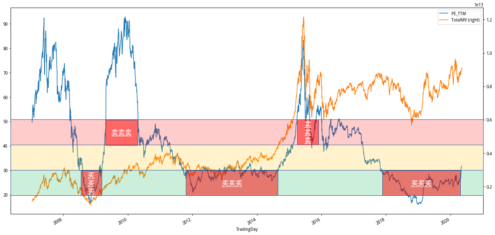
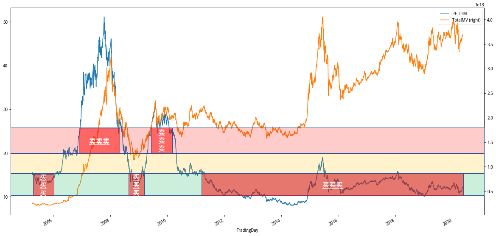

# 聚宽学习周记二十：指数基金定投实践的估值调整

由于本周刚好总结了对于指数估值的想法，因此就顺便将它们作为周记的内容。

## 从新年计划说起

我在2019年末发布的[《新年ETF基金定投计划》](https://www.joinquant.com/view/community/detail/10c029abcd8f69bd59b8b1172a547d31)里确定了2020年ETF定投计划。ETF中文名称为“交易所交易基金”，英文全称 “Exchange Traded Fund”。大部分ETF均是指数型基金，即基于某种市场指数构建的被动型开放式基金。这样说起来可能有点抽象，简单理解就是把募集的资金（按权重）去购买某只指数的（部分或所有）成分股，那么这只基金的收益走势与该指数的走势基本相同了，当然实际上依然存在少量的跟踪偏差。

从2020年第1周到现在第20周近半年的实践中主要定投了“500ETF”（基金代码：510500）和“能源ETF”（基金代码：159930）两只指数基金，它们分别基于“中证500指数”（指数代码：000905）和“中证能源指数”（指数代码：000928）进行构建。定投指数基金，需要把这里的“基金”与“指数”之间的区别搞清楚的，因为在我们进行基金交易的时候需要去评估基金贵不贵，而这通常藉由参考基金对应的指数的估值来判断。

在读过两本有关指数基金定投的书籍之后，我曾在2月底的时候更新过定投策略，那次调整将最初按月定额定投变更为随着估值的变化增加定投的频率和金额，比如针对500ETF定投策略的更新描述如下：

变更之前：

>1. 当中证500指数的市盈率在20以下时，每月定投3000元。
>2. 当中证500指数的市盈率在20以上，30以下时，每月定投2000元。
>3. 当中证500指数的市盈率在30以下，40以下时，每月定投1000元。

变更之后：

>1. 当中证500指数的市盈率在20以下时，每周定投5000元。
>2. 当中证500指数的市盈率在20以上，30以下时，每月定投3000元。
>3. 当中证500指数的市盈率在30以下，40以下时，停止定投。

那次更新只是让定投方式变得更灵活了，在指数估值上依然参照绝对的市盈率。策略指示图如下所示，绿色区间属于定投期间，黄色区间属于持有期间，红色区间则是卖出区间。

## 策略中存在的问题

上面策略主要是依据ETF对应指数的市盈率来进行交易，比如“500ETF”（510500）对标的是中证500指数（000905），那我就需要参考中证500指数的市盈率来确定定投的金额和频次的。

随着对指数估值了解的增加，我逐渐意识到使用指数市盈率的绝对值进行估值有不足的地方。为了便于理解其中存在的问题，如下分别获取了中证500指数（2007年1月15日发布）和沪深300指数（2005年4月8日发布）自发布之日起的市盈率来进行演示。

我们先看基于中证500指数构建的被动指数基金的定投。按照市盈率30以下买入、市盈率40以上卖出的交易策略，在过去的13年有如下的交易行为：

看起来还不错，低买高卖，完美。这也是最初选择市盈率的绝对值来作为对中证500指数的交易参考的主要原因：中证500的市盈率历史走势具有明显的周期性。

我们再看看基于沪深300指数构建的被动指数基金的定投。按照市盈率15以下买入、市盈率20以上卖出的交易策略，在过去的13年有如下的交易行为：

从上图中可以看到沪深300的市盈率历史走势相对中证500来说就没有那么明显的周期性了，这会导致我们最近10年一直在买买买。买买买尽管不一定是亏损的，因为尽管市盈率徘徊在低位，但总的市值在增加（瞧图中的橙线）。然而，对于普通投资者来说，要持续10年的不断投入，无论是对资金还是耐心确实是一个不低的要求。

综上，我们可以发现使用绝对市盈率对指数进行估值时的不足之处：指数的整体市盈率的变动趋势无法保证明显的周期性特征，比如沪深300指数在2010年之前的变动具有波峰、波谷循环的走势，但在2010年之后就没有明显的特征可以依据了。中证500自发布至今较好地保持了周期性波动，但无法确保以后这种特征是否能够延续。

## 引入“历史百分位”

针对如上提到的采用绝对市盈率对指数进行估值的不足，我们引入“历史百分位”的方法。这是一种相对的估值方法，比如市盈率的历史百分位计算的是某只证券/指数当前的市盈率在过去某个日期内所处的位置，通俗点来说过去该只证券/指数有多长时间（百分比）是处在当前市盈率以下。

举个例子，某只上市1000天的股票最近一个交易日的市盈率为8.2，而过去1000天有365天是市盈率小于8.2，那么我们可以说当前这只股票的市盈率历史百分位处在：365/1000 = 36.50%。

由于未来的走势无法预测，采用历史百分位的方法并不能完全解决估值上的问题，但是可以缓解绝对估值法的不足。比如，我们将中证500历史百分位走势（上半部分）和中证500历史市盈率和市值（下半部分）重叠在一起进行观察：

图中上半部分里面：① 黄线表示用5年滑动窗口计算的市盈率百分位，比如假设2012年1月1日市盈率百分位值为0.12，那么这意味着当天的市盈率处在前5年的12%。② 蓝线与图下半部分里面的相同，表示指数的市盈率走势。③ 那三条不同演示的虚线指数从发布至今的所有市盈率数据里面30%、50%和70%的百分位线。

突中下半部分里面：① 橙线表示指数对应的市值走势。② 蓝线就是市盈率走势。

我们在“策略中存在的问题”这一节里面讲解的是单纯从图中下半部分里的绝对市盈率来进行估值，确认指数的低估和高估状态，也就是对应指数基金交易的买入和卖出时间的。我们这个时候要做的工作便是要运用图中的上半部分来补充使用绝对市盈率进行估值的不足。

当然，不管是估值也好，还是交易也好，我们通常都是没有办法做到精确。所以，也只能在这里比较粗略地指定一个指标来确定高估，比如以“当5年期的市盈率百分位超过80%”的标准来判定指数进入高估状态，高估之后是需要卖出对应的证券的。

我们将这种基于百分位的估值方法同样应用到沪深300指数上，于是有下面这样的示意图。从图中可以看到在之前以市盈率绝对值的估值方法，我们在2011年之后的近10年一直在买买买，哪怕在2015年7月那段反复熔断的岁月里也是如此，这是一个非常明显可以优化的地方。但是当我们结合历史百分位进行估值的时候，可以看到在2015年、2017年、2018年均出现高估的时机。

对于这次指数估值的调整，并不是找到了正确的估值方法，要知道市场随时在变化，很难有一直有效的银弹。这次调整，全因在网络上学习他人经验的时候碰到了这个“历史百分比”关键词，一番查找、理解之后，意识到了当前自己定投策略上的不足之处。所以，这是对自身实践过程中的一次纠正。

如下以中证500指数为例，列出年初至今的策略更新记录：

**版本一：年初制定的定投策略**

- 1. 当中证500指数的市盈率在20以下时，每月定投3000元。
- 2. 当中证500指数的市盈率在20以上，30以下时，每月定投2000元。
- 3. 当中证500指数的市盈率在30以下，40以下时，每月定投1000元。

**版本二：读了两本有关指数基金投资的书之后的更新**

- 1. 当中证500指数的市盈率在20以下时，每周定投5000元。
- 2. 当中证500指数的市盈率在20以上，30以下时，每月定投3000元。
- 3. 当中证500指数的市盈率在30以下，40以下时，停止定投。

**版本三：网络上（聚宽/雪球）学习了其他人经验之后的更新**

- 1. 当中证500指数近5年市盈率百分位在%20以下时，每周定投5000元。
- 2. 当中证500指数近5年市盈率百分位在%50以下时，每月定投3000元。
- 3. 当中证500指数近5年市盈率百分位在%50以上时，停止定投。
