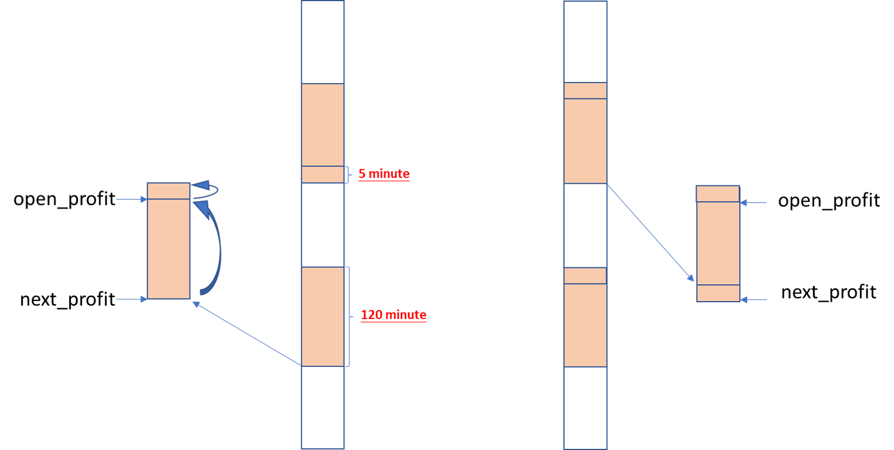

# 聚宽学习周记二二：详解@云帆的“高频因子探索——动量交易”（上）

本周继续学习@云帆的[高频因子探索——动量交易](https://www.joinquant.com/view/community/detail/22472)，先将其中的代码解释完。


## 一、代码解释

### 代码片段1：获取每天的分组收益

```
#对每一天的数据分组，多天数据合并

def get_day_profit(day_data,date,sel_n):
    '''
    获取每天的收益列表，

    '''
    day_data = day_data.dropna()
    new_col = ['back_profit','open_profit','next_profit']
    day_data = day_data[new_col]
    #删除开盘没有涨跌的股票
    sel_data = day_data[day_data['open_profit'] == 0].index
    day_data = day_data.drop(sel_data,axis=0)
    cut_day_data = cut_data(day_data,cut_layer)
    col = cut_day_data.columns
    #选出对应股票
    #sel_day_data = cut_day_data[col[0]][cut_day_data[col[0]] == sel_n]
    #sel_day_stocks = list(sel_day_data.index)

    group_day_data = cut_day_data.groupby(['open_profit']).mean()
    day_profit = group_day_data.iloc[sel_n-1,-1]
    day_profit = pd.DataFrame([day_profit],index=[date],columns=['profit'])
    return day_profit
```

这个函数是按天来对某一天的动量数据进行分层处理，“分层”上周已经提到过，是用百分位（划分为1~10档）来替换以涨幅表示的动量数据。之后按照开盘价`open_profit`进行分组，且选择开盘价动量值最大的分组对应收益的均值。

这里解释下pandas里面`groupby()`函数的用法。函数`groupby()`是对DataFrame进行分组，这个分组的操作通常仅仅是一系列操作中的排头阵。也就是说，我们在应用`groupby()`这个函数不仅是“为了分组而分组”，而是“为了更重要的目的不得不先进行分组”。

比如，下面的例子展示的是求取每组分组的均值。在这个例子里面我们分组不是目的，而求取每个分组才是目的。这个例子很形象，理解了它再去理解上面代码里面中`groupby()`的应用就更容易了。

```
df = pd.DataFrame({'Animal': ['Falcon', 'Falcon',
                              'Parrot', 'Parrot'],
                   'Max Speed': [380., 370., 24., 26.]})
df
   Animal  Max Speed
0  Falcon      380.0
1  Falcon      370.0
2  Parrot       24.0
3  Parrot       26.0
df.groupby(['Animal']).mean()
        Max Speed
Animal
Falcon      375.0
Parrot       25.0
```

参考：

- [pandas.DataFrame.groupby](https://pandas.pydata.org/pandas-docs/stable/reference/api/pandas.DataFrame.groupby.html)


### 代码片段2：从分组收益中获取指定层的收益

```
#选择每天的分层数据中收益较高的层
sel_n = 8
day_profit_l = []
for key in keys:
    day_data = dic_res[key]

    day_profit = get_day_profit(day_data,key,sel_n)
    day_profit_l.append(day_profit)
profit_df = pd.concat(day_profit_l)
```

这段代码是对上面定义的函数`get_day_profit()`的使用，通过它来获取每天的分层对应的收益数据，保存起来。这里每天的分层收益数据都是一个DataFrame类型的数据，比如获取到的2019-09-02这天的数据是下面这样：

```
            profit
2019-09-02  0.011311
```

连续多天的这样的数据保存在列表里面，最后使用`concat()`函数将多个日期的按照动量分层之后的数据拼接为一个DataFrame数据，就成了下面这样：

```
            profit
2019-09-02  0.011311
2019-09-03 -0.002441
2019-09-04  0.004716
```

### 代码片段3：计算基准收益并进行收益对比

```
index = list(profit_df.index)
base_start_date = index[0]
base_end_date = index[-1]
base_price = get_price('000300.XSHG',start_date=base_start_date,end_date = base_end_date,fields=['close'])['close']
profit_df['cum_profit'] = (profit_df['profit'] + 1).cumprod()

#计算基准收益，以沪深300为准
base_price = get_price('000300.XSHG',start_date=base_start_date,end_date = base_end_date,fields=['close'])['close']
base_pofit = base_price.pct_change().dropna()
base_profit_cump = (base_pofit + 1).cumprod()
index = list(base_profit_cump.index)
new_index = [datetime.datetime.strftime(i,'%Y-%m-%d') for i in index ]
base_profit_cump.index = new_index
base_profit_cump.name = 'base_profit'

profit_df_combine = pd.concat([profit_df,base_profit_cump],axis=1).dropna()
print(profit_df_combine.tail())

draw_profit = profit_df_combine[['cum_profit','base_profit']]
draw_profit.plot(figsize=(15,8))
plt.show()
base_profit_show = profit_df_combine['base_profit'][-1]
stratage_profit_show = profit_df_combine['cum_profit'][-1]
print('base profit is: %s'%(str(round((base_profit_show-1)*100,2)) + '%'))
print('strage profit is: %s'%(str(round((stratage_profit_show-1)*100,2)) + '%'))

max_drawdown = find_max_drawdown(profit_df_combine['cum_profit'])
print('max drawdown is: %s' %(str(round(max_drawdown*100,2)) + '%'))
```

如上的代码写得比较紧密，为了更好的理解，我将其再进行了排版和注释，如下：

```
#计算基准收益，以沪深300为准
index = list(profit_df.index)
base_start_date = index[0]
base_end_date = index[-1]
base_price = get_price('000300.XSHG',start_date=base_start_date,end_date = base_end_date,fields=['close'])['close']
base_pofit = base_price.pct_change().dropna()
base_profit_cump = (base_pofit + 1).cumprod()
index = list(base_profit_cump.index)
new_index = [datetime.datetime.strftime(i,'%Y-%m-%d') for i in index ]
base_profit_cump.index = new_index
base_profit_cump.name = 'base_profit'

# 对上面分层得到的每天的收益基础上再添加一列，这一列是“累乘值”
profit_df['cum_profit'] = (profit_df['profit'] + 1).cumprod()

# 将基准收益附加到分层收益上
profit_df_combine = pd.concat([profit_df,base_profit_cump],axis=1).dropna()
print(profit_df_combine.tail())

# 对比分层得到的收益和基准收益的对比图，然后打印出收益率和最大回测
draw_profit = profit_df_combine[['cum_profit','base_profit']]
draw_profit.plot(figsize=(15,8))
plt.show()
base_profit_show = profit_df_combine['base_profit'][-1]
stratage_profit_show = profit_df_combine['cum_profit'][-1]
print('base profit is: %s'%(str(round((base_profit_show-1)*100,2)) + '%'))
print('strage profit is: %s'%(str(round((stratage_profit_show-1)*100,2)) + '%'))

max_drawdown = find_max_drawdown(profit_df_combine['cum_profit'])
print('max drawdown is: %s' %(str(round(max_drawdown*100,2)) + '%'))
```

在上面代码里面有一个最主要的关键点，不知道其他人怎么样，我在这上面倒是花了一小时左右的时间来理解它。这个关键点就是在计算收益的时候使用的`(base_pofit + 1).cumprod()`，我主要奇怪两个地方：

- 为什么要进行`+ 1`的处理？
- 为什么要用`cumprod()`来进行累乘？

理解这上面两点我是一步一步对比一些数据之后才逐步理解的，这里以基准收益的计算将整个理解过程记录一下。首先，我们知道最初的基准收益数据为`base_price`，它里面包含的是多个交易日的收盘价，我们假设内容像下面这样，这里为了方便理解我随便写的：

```
            收盘价
2019-01-02  100
2019-01-03  110
2019-01-04  100
2019-01-07  90
2019-01-08  120
```

然后我们会根据收盘价来计算每天的收益，方法是调用`pct_change()`函数计算当前交易日与前一个交易日的涨幅比例：

```
           收益
2019-01-02  NA
2019-01-03  10.00%
2019-01-04  -9.09%
2019-01-07  -10.00%
2019-01-08  33.33%
```

但上面这些收益都是以前一天的收盘价作为基础的，而我们实际上想要得出的收益是相对于第一个交易日的收益，比如我们想要的是2019-01-08相对于2019-01-02的收益，即(120 - 100) / 100 = 20.00%，而并不是要2019-01-08相对于前一交易日即2019-01-07的 33.33%。那怎么办呢？

其实这个时候就需要“累乘”的概念了，我们需要将上面的“基于前一个交易日的涨幅数据”替换为“基于第一个交易日的倍数”，这样我们可以得到每个交易日相对于第一个交易日的倍数：

```
           收益      基于第一个交易日的累乘数
2019-01-02  NA
2019-01-03  10.00%   1 * (1 + 10.00%)
2019-01-04  -9.09%   1 * (1 + 10.00%) * (1 - 9.09%)
2019-01-07  -10.00%  1 * (1 + 10.00%) * (1 - 9.09%) * (1 - 10.00%)
2019-01-08  33.33%   1 * (1 + 10.00%) * (1 - 9.09%) * (1 - 10.00%) * (1 + 33.33%)
```

这个累乘数/倍数就体现了相对于第一个交易日的绝对收益，最后我们只需要将这个数减1就得到了最终收益了。但是，在计算这个累乘数的时候就需要我们首先将前对于前一天的“收益率 + 1”再“进行累乘”操作。

另外，这里还有个计算最大回测的函数。最大回撤的概念在[聚宽学习第五周周记：中证指数共享函数使用更新与策略指标的理解](https://www.joinquant.com/view/community/detail/99a6ea4179cfa056552d3567b3387bc6)里面已经提到过了，将其中的关键内容拿过来再用用：最大回撤表示“可能出现的最糟糕的情况”，包括了两个要素：

- “策略收益的最大值”和“策略收益的最小值”
- “策略收益的最小值”一定是整个策略周期的收益最小值，但是“策略收益的最大值”不一定是整个策略周期的最大值，而是出现在策略收益最小值之前的最大值。

简单点解释最大回撤就是“回过头来看，假设你卖在策略收益最低点的那个最让你懊悔的地方计算出来的收益率”。比如你在2020年1月1日100块钱买入，到2020年5月5日市值达到200元，到2020年9月9日跌倒50元，2020年12月31日市值为250元，那么最大回测为（200 - 50）/ 200 = 75%。也就是说明明你在2020年5月5日卖出可以挣得100块钱，结果你没有拿住，在2020年9月9日割肉净亏损50块。

原文中最大回测的实现放在最前面，上周解释代码的时候漏掉了，这里放上来：

```
def find_max_drawdown(returns):
    #returns 为cumprod收益
    # 定义最大回撤的变量
    result = 0
    # 记录最高的回报率点
    historical_return = 0
    # 遍历所有日期
    for i in range(len(returns)):
        # 最高回报率记录
        historical_return = max(historical_return, returns[i])
        # 最大回撤记录
        drawdown = 1 - (returns[i]) / (historical_return)
        # 记录最大回撤
        result = max(drawdown, result)
    # 返回最大回撤值
    return result
```

到这里总算把这篇文章里面的代码全部理解了一遍。有以下几个收获：

- 知道了计算动量的更为简便的方式。
- 见识了借用分位数对数据进行分层处理。
- 学习到了针对收益率的计算方法。
- 学习到了一种不错的利用动量数据进行高频交易探索的实验方法。


## 上周计划

### 1. 继续学习@云帆的[高频因子探索——动量交易](https://www.joinquant.com/view/community/detail/22472)。

重复理解了一下原文中的`get_profit_minutes_period()`和`get_open_profit_minutes_period()`函数，始终觉得有难以理解的地方。重新理解如下：

函数`get_profit_minutes_period()`的注释是“计算date前一天最后一段时间的动量收益，n为开盘收益计算时间长度，next_n为开盘后收益计算长度”，但到底是什么意思呢？我们假设按照默认值n=5, next_n=120来理解，那么：

- `open_profit`列的数据为下午开盘后1分钟相对于前5分钟的动量数据。*衡量下午开盘时的动量。*
- `next_profit`列的数据为下午开盘后120分钟的数据相当于前120分钟，即下午收盘时相对于下午开盘时的动量。*衡量下午收盘时的动量。*

函数`get_open_profit_minutes_period()`的注释是“计算date前一天开盘的动量收益，n为开盘收益计算时间长度，next_n为开盘后收益计算长度”，我们依然按照默认值n=5, next_n=120来理解，由于函数中获取到的是前一天240分钟（即整天的行情数据），那么：

- `open_profit`列的数据为上午开盘后5分钟相对于上午开盘时的动量数据。*衡量上午开盘时的动量。*
- `next_profit`列的数据为下午开盘后5分钟相对于上午开盘时的动量数据。*衡量上午收盘时的动量。*

我在阅读代码的时候始终觉得这两个函数似同似异，就算写出自己的理解也没有完全明白，于是只好画了下面这张图才算明白了：



按如上图示，这两个函数一个计算上午开盘和收盘的动量，另一个计算下午开盘和收盘的动量，两者计算开盘和收盘动量的计算长度不一样。相同点在于两个函数开盘时都按5分钟时长进行计算，收盘时都按120分钟进行计算；不同点在于计算上午收盘时的动量取用了下午开始5分钟做为补充数据，而计算下午开盘时动量取用了上午最后5分钟作为补充数据。

为什么要这么上下补充呢，可能的原因为：当前是为了以半天为粒度来衡量消息面的影响，所以都是默认以120分钟做为计算动量的时间长度。而按照5分钟的步长来计算开盘时动量时，如果以上午第1分钟来计算动量那么就需要获取前一天的数据了，这样显得负杂，所以就有了：1，以上午开盘后5分钟来获取开盘时动量数据，然后再顺眼120分钟获取上午收盘时的动量。2，下午开盘第1分钟直接计算相对于前5分钟的步长。

我在这里的想法是，如果要衡量消息面在上午、下午开盘/收盘之间的关系来进行高频交易，那么实际上我们可以不用进行5分钟补位的操作，而直接计算：

- 上午开盘后5分钟的动量数据，上午收盘时的动量数据；
- 下午开盘后5分钟的动量数据，下午收盘时的动量数据；


2. 基于本周学习到的新的动量计算算法，以及前面两周研究指数上面的一些理解，尝试着写作基于ETF的交易策略。

没有做。


## 新学内容

### 1.函数`get_price()`和`get_bars()`的区别是什么？

聚宽里面策略模板里面是使用`get_bars()`来获取过去的股票收盘价，但是我在学习过程中又见到不少人是使用`get_price()`来获取过去的股票收盘价的，那么它们之间的区别是什么呢？回测时该如何使用呢？

查找[Python版API](https://www.joinquant.com/help/api/help?name=JQData)可以知道它们有如下异同：

- `get_price()`用来查询多个标的多个数据字段，注意，这个函数只支持“按天或者按分钟”（可以指定多天或者多分钟的 *实时行情或历史行情*。返回数据格式为 DataFrame。

- 当我们要获取行情数据的频率不是按“天/分钟”时，我们就需要使用`get_bars()`了，因为这个函数可以获取各种时间频率的行情数据，比如'1m', '5m', '15m', '30m', '60m', '120m', '1d', '1w'(一周), '1M'（一月）。`get_bars` 可查询单个或多个标的多个数据字段，返回数据格式为 numpy.ndarray或DataFrame。获得各种时间周期的bar数据。


## 下周计划

1. 理解了这篇文章之后觉得有两个作业要做完来加深理解，其一为重新实现文中的函数，并且按照上面自己提到的以半天计算动量的方式来进行探索；其二为基于探索的结果写作简单的策略来观察执行效果。

2. 上周遗留作业：基于本周学习到的新的动量计算算法，以及前面两周研究指数上面的一些理解，尝试着写作基于ETF的交易策略。
