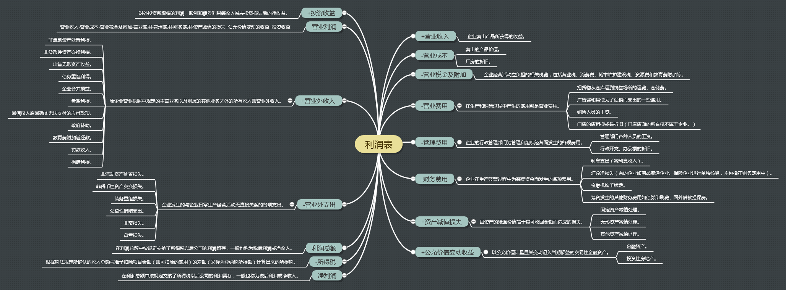

## 一、利润表项目释义

### 营业收入 +

企业卖出产品所获得的收益。

### 营业成本 -

企业卖出产品，也即卖出产品所包含的所有物质成本。

### 税金项目 -

- 营业税金及附加

企业经营活动应负担的相关税费，包括营业税、消费税、城市维护建设税、资源税和教育费附加等。
企业应通过“营业税金及附加”科目，核算企业经营活动相关税费的发生和结转情况。

营业税是国家对工商营利事业按营业额征收的税，属于流转课税的一类，常见的流转税有营业税和增
值税。

> *注：所得税不同于流转税：只有赚到了钱才需要缴纳所得税，而无论是否赚到钱，只要是有业务
的企业就都得缴纳流转。*

#### 1 营业税

营业税是一种价内税（Tax Included in Price），即税金包含在商品价值或价格之内的税。

比如说，你去一家饭馆吃饭，一共花费了100元，你只需付给饭馆 100元，而无须考虑饭馆是否需要
缴纳营业税。但事实上，如果饭馆的营业税率是5%，那么饭馆虽然从你这里获得了100元钱，但实际
只收入了95元，其余5元是税收的成本，是饭馆必须承担的成本。也就是说，营业税是由经营者承担
的一种税收成本。

#### 2 增值税

增值税是一种价外税（Tax Excluded in Price），即税金不包含在商品价值或价格之外的税。

增值税（Value-added Tax）属于销售税，是一种由消费者承担的税费，属累退税，是基于商品或服
务的增值而征税的一种间接税，增值税征收通常包括生产、流通或消费过程中的各个环节，是基于增
值额或价差为计税依据的中性税种。

比如说，你在一家电子产品专营店里看中了一台价值 1万元的电脑，但是要把电脑拿走，你除了需要
支付这1万元以外，还需要支付1700元的增值税。消费者为获得商品必须额外支付增值税，因此，增
值税是由消费者承担的一种税收成本。

营业税由经营者承担，增值税由消费者承担，因此，在经营者的利润表中，只能出现营业税税收成本，
而不会出现增值税税收成本。

> *虽说增值税是消费者承担的，但实际上消费者在买东西的时候，卖方也已经替税务局从消费者这
里收了税（也即增值税也已经体现在了价格里），因此，经营者有义务将收到的那1700元钱上缴税务
局。这笔钱在最初便是属于税务局的，所以它属于“负债”，在资产负债表中录入“应交税金”。*

### 费用项目 -

- 营业费用
- 管理费用
- 财务费用

费用（Expense），用于描述公司为销售而发生的各种成本支出、杂项管理、利息、税金，以及其他
影响利润表的项目。

#### 1 营业费用

对一个生产产品、销售产品的企业来说，在生产和销售过程中产生的费用就是营业费用。比如说把货
物从仓库运到销售场所的运费、仓储费、广告费和其他为了促销而支出的一些费用、销售人员的工资、
门店的店租抑或是折旧——视乎门店店面的所有权是否在企业自己手上，等等。

#### 2 管理费用

企业的行政管理部门为管理和组织经营而发生的各项费用。

管理费用就是与企业的管理环节有关的一切费用。比如说管理部门各种人员的工资，比如说行政开支、
办公楼的折旧等，都是管理费用。因此，不同类型工作人员的工资往往属于不同的项目——销售人员的
工资属于营业费用，而管理人员的工资属于管理费用。不同类型的固定资产的折旧也属于不同的项目，
门店的折旧属于营业费用，办公楼的折旧属于管理费用，而厂房的折旧属于生产成本。

#### 3 财务费用

企业在生产经营过程中为筹集资金而发生的各项费用。包括企业生产经营期间发生的利息支出（减利
息收入）、汇兑净损失（有的企业如商品流通企业、保险企业进行单独核算，不包括在财务费用中）、
金融机构手续费，以及筹资发生的其他财务费用如债券印刷费、国外借款担保费等。

企业会为长期借款或短期借款付出一定的利息，也会因在银行存款而获得一部分利息，这些利息都记
录在这里。也即是说，利润表上的财务费用，包含了借款利息减去存款利息的净额。所以在正常情况
下，财务费用是一个正数，但在特殊情况下，财务费用也有可能是一个负数。

比如说，小张的公司筹集了大量的资金，这些钱暂时还没有被用掉，那这些钱就会帮助企业获得大量
利息收入；另一方面，如果这笔钱是企业通过股权融资，而不是通过借贷获得的，就不会让企业背上
过重的利息负担。在这种情况下，财务费用就变成了一个负数。此时，财务费用虽然是一个费用项目，
但事实上它是增加利润的。

### 资产减值损失 -

因资产的账面价值高于其可收回金额而造成的损失。会计准则规定资产减值范围主要是固定资产、无
形资产以及除特别规定外的其他资产减值的处理。

大部分资产是按历史成本来计价的，如果资产发生了减值的话，就需要扣除这部分减值，利润也会相
应受到影响。

### 公允价值变动收益 +

以公允价值计量且其变动记入当期损益的交易性金融资产。在资产负债表日，“交易性金融资产”的公
允价值高于其账面价值的差额，应借记“交易性金融资产－公允价值变动”，贷记“公允价值变动损益”，
公允价值低于其账面价值的差额，则做相反的分录。

金融资产和投资性房地产是按照公允价值来计价的，倘若某项资产当前时刻的价值比去年同期增长5元，
那这5元便是该项资产一年来的收益。倘若该资产在这一年的时间里，不仅没有获得收益，反倒减值5元，
那该公司便产生了5元的损失。这种收益或损失，便被称作“公允价值变动收益”。

> *"资产减值损失"和“公允价值变动收益”这两项实际上都是由资产价格变化引起的利润的增减变化。*

### 投资收益 +

对外投资所取得的利润、股利和债券利息等收入减去投资损失后的净收益。

比如小张公司的子公司给小张的公司分红了，那这笔钱就是小张公司的投资收益。实际上，投资收益
可以说是小张以成立子公司这种特殊方式进行的营业活动，所以仍旧是营业利润当中的一部分。

### 营业利润

企业利润的主要来源，主要由营业收入、营业成本、期间费用、资产减值损失、公允价值变动净收益、
投资净收益构成。

### 营业外收入 +

除企业营业执照中规定的主营业务以及附属的其他业务之外的所有收入即营业外收入。营业外收入主
要包括：非流动资产处置利得、非货币性资产交换利得、出售无形资产收益、债务重组利得、企业合
并损益、盘盈利得、因债权人原因确实无法支付的应付款项、政府补助、教育费附加返还款、罚款收
入、捐赠利得等。

比如说小黄的公司卖掉了一台闲置的设备，由此获得的收益即为营业外收入。这是因为公司经营的目
的是通过出售产品赚钱，而不是通过出售自己的固定资产（设备）赚钱，所以出售固定资产的收益就
不属于营业利润，而是营业外收入。除此以外，额外的奖励或者赔偿，也是企业的营业外收入。

### 营业外支出 -

企业发生的与企业日常生产经营活动无直接关系的各项支出。包括非流动资产处置损失、非货币性资
产交换损失、债务重组损失、公益性捐赠支出、非常损失、盘亏损失等。

比如，如果获得的赔偿和奖励是营业外收入，那么如果公司因为违规而遭受处罚，或者火灾、水灾、
地震所导致的损失，就应该是营业外支出了。

> *营业外收入和营业外支出都跟经营活动没有一毛钱的关系，它们都是由偶然因素造成，没有办法
延续下去。也正因为如此，营业外收入通常都显得不那么靠谱。*

>*有的公司还会有汇兑损益。比如外贸公司有大量出口业务，当收入美元之后，它必须将其兑换为人
民币。在这一过程中，由于汇率不断发生变化，就难免产生汇兑损益。*

### 利润总额

一家企业在一定时间内到底赚到了多少钱。

营业利润+营业外的收入-营业外的支出+补贴收入+汇兑损益（视该企业是否有外贸业务而定）。

### 所得税费用 -

中国企业的所得税税率一般在25%，但企业利润总额的75%通常不是这家企业的净利润了。这是因为这
里的25%是应税所得的25%，而非利润总额的25%。利润总额是以会计准则为基础计算出来的，而应税
所得是以税法为基础计算出来的，税法和会计准则虽然有很多相似的地方，但二者之间的差异也不小。

比如，小张的公司请小红的公司为自己设计制作一则广告。在利润表上，也就是按会计准则的标准来
看，这笔广告支出应该被归为营业费用这一项；而税法却规定，当公司的广告支出超过营业收入的15%
之后，超过的部分就不能在税前列支了。比如说，今年盈利达到1亿元的小张就只能将1500万元的广
告费列入营业费用支出，如果他实际上花费了2000万元的广告费，那么剩余的500万元虽然明明支出
了，却不得不和利润总额一起变成缴纳税款的基数。因此，小张公司的应税所得要比利润总额多出500
万元，这500万元也要按照25%的所得税率缴纳所得税。

应纳税所得（Taxable Income）：收入扣除成本、费用等之后的纯收益，纳税人取得任何一项所得，
都有相应的消耗和支出，应予以扣除。只有企业取得的所得扣除为取得这些所得而发生的成本费用支
出后的余额，才是企业所得税的应税所得。

应税利润（Taxable Profit）：根据税法规定所确认的收入总额与准予扣除项目金额（即可扣除的
费用）的差额，又称为应纳税所得额，是企业应纳所得税的计税依据。

>*应纳税所得相当于企业自己计算的一笔账，而应税利润是按照税法计算出来的另一笔账。*

### 净利润

在利润总额中按规定交纳了所得税以后公司的利润留存，一般也称为税后利润或净收入。

《公司理财》里面提到：“经营性利润扣除利息支出和税收就得到净利润。”那么这里的“经营性利润”
相当于国内的“利润总额” + “利息支出”。

## 二、脑图

## 三、补充

### 息税前利润 / EBIT

也称为“经营性净利润”，指在扣除异常项目、非延续性经营活动或是特殊项目前所得的利润。计算EBIT
时只需用“经营活动总收入扣减经营活动总成本”即可得到。分析师都青睐EBIT，因为它可以排除资本
结构（利息支出）和税收的影响，而单独提取盈余的差异部分。

*这里需要注意一下中美报表格式的差异：美国的EBIT可以直接通过总收入-总成本得到，但我国的利
息支出是计入总成本的，因此国内报表的EBIT = 总收入 - 总成本 + 利息收入。*

### 息税及折旧和摊销前的利润 / EBITDA

EBITDA = EBIT + 折旧和摊销。

摊销指的是类似折旧的非现金性支出，不过与折旧相比，它应用于无形资产（如一项专利），而不是
有形资产（如一台机器）。分析师喜欢应用EBITDA指标，因为它将两项非现金项目加回到EBIT中，因
此是税前经营性现金流的更加指标。

## 参考

- 肖星，《一本书读懂财报》，浙江大学出版社。
- 斯蒂芬 A.罗斯，《公司理财》。
