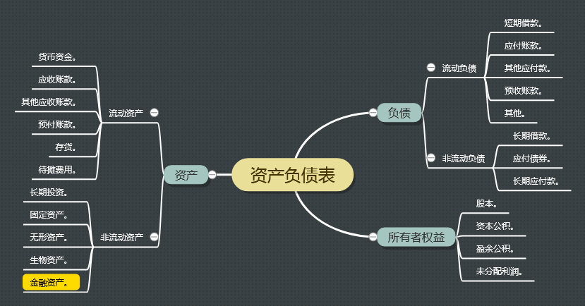

# 一、资产负债表项目

- 资产部分
  - 1-货币资金
  - 2-应收账款
  - 3-其他应收账款
  - 4-预付账款
  - 5-存货
  - 6-待摊费用
  - 7-长期投资
  - 8-固定资产
  - 9-无形资产
  - 10-生物资产
  - 11-金融资产
- 负债部分
  - 1-短期借款
  - 2-应付账款（Accounts Payable）
  - 3-其他应付款（Other Payables）
  - 4-预收账款（Deposit Received）
  - 5-其他
  - 6-长期借款
  - 7-应付债券（Bond Payable）
  - 8-长期应付款（Long-term Payable）
- 所有者权益部分
  - 1-股本（Capital Stock）
  - 2-资本公积（Additional Paid-in Capital）
  - 3-盈余公积（Surplus Zeserve）
  - 4-未分配利润（Retained Earnings）

# 二、脑图

# 三、参考

- 肖星，《一本书读懂财报》，浙江大学出版社。
- [待摊费用](https://wiki.mbalib.com/wiki/%E5%BE%85%E6%91%8A%E8%B4%B9%E7%94%A8)
- [彻底理解“资本性支出”](https://zhuanlan.zhihu.com/p/24462170)
