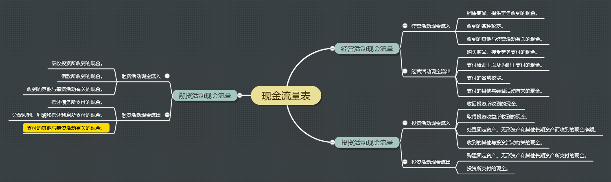

## 一、现金流量项目释义

### 经营活动现金流量（Cash from Operating Activities）

企业投资活动和筹资活动以外的所有的交易和事项产生的现金流量。它是企业现金的主要来源。

#### 1 经营活动现金流入

- 销售商品、提供劳务收到的现金。
- 收到的各种税费。
- 收到的其他与经营活动有关的现金。

#### 2 经营活动现金流出

- 购买商品、接受劳务支付的现金。
- 支付给职工以及为职工支付的现金。
- 支付的各项税费。
- 支付的其他与经营活动有关的现金。

### 投资活动现金流量（Cash from Investing Activities）

企业长期资产（通常指一年以上）的购建及其处置产生的现金流量，包括购建固定资产、长期投资现
金流量和处置长期资产现金流量，并按其性质分项列示。

#### 1 投资活动现金流入

- 收回投资所收到的现金：企业出售、转让或到期收回除现金等价物以外的短期投资、长期股权投资
而收到的现金，以及收回长期债权投资本金而收到的现金。不包括长期债权投资收回的利息，以及收
回的非现金资产。

- 取得投资收益所收到的现金：企业因各种投资而分得的现金股利、利润、利息等。

- 处置固定资产、无形资产和其他长期资产而收到的现金净额：企业处置固定资产、无形资产和其他
长期资产所取得的现金，扣除为处置这些资产而支付的有关费用后的净额。由于自然灾害所造成的固
定资产等长期资产损失而收到的保险赔偿收入，也在本项目反映。

- 收到的其他与投资活动有关的现金：企业除了上述各项以外，收到的其他与投资活动有关的现金流
入。其他现金流入如价值较大的，应单列项目反映。

#### 2 投资活动现金流出

- 购建固定资产、无形资产和其他长期资产所支付的现金：企业购买、建造固定资产，取得无形资产
和其他长期资产所支付的现金，不包括为购建固定资产而发生的借款利息资本化的部分，以及融资租
入固定资产支付的租赁费，借款利息和融资租入固定资产支付的租赁费，在筹资活动产生的现金流量
中单独反映。企业以分期付款方式购建的固定资产，其首次付款支付的现金作为投资活动的现金流出，
以后各期支付的现金作为筹资活动的现金流出。

- 投资所支付的现金：企业进行各种性质的投资所支付的现金，包括企业取得的除现金等价物以外的
短期股票投资、长期股权投资支付的现金、长期债券投资支付的现金，以及支付的佣金、手续费等附
加费用。

### 融资活动现金流量（Cash from Financing Activities）

导致企业资本及债务的规模和构成发生变化的活动所产生的现金流量。

#### 1 融资活动现金流入

- 吸收投资所收到的现金：反映企业收到的投资者投入的现金，包括以发行股票方式筹集的资金实际
收到股款净额（发行收入减去支付的佣金等发行费用后的净额）、发行债券实际收到的现金（发行收
入减去支付的佣金等发行费用后的净额）等。

- 借款所收到的现金：反映企业举借各种短期、长期借款所收到的现金。

- 收到的其他与筹资活动有关的现金：反映企业除上述各项目外，收到的其他与筹资活动有关的现金
流入，如接受现金捐赠等。

#### 2 融资活动现金流出

- 偿还债务所支付的现金：反映企业以现金偿还债务的本金，包括偿还金融企业的借款本金、偿还债
券本金等。企业偿还的借款利息、债券利息，在“偿债利息所支付的现金”项目中反映，不包括在本项
目内。

- 分配股利、利润和偿还利息所支付的现金：反映企业实际支付的现金股利、利润，以及支付
给其他投资的利息。

- 支付的其他与筹资活动有关的现金：反映企业除了上述各项外，支付的其他与筹资活动有关的现金
流出，如捐赠现金支出等。其他现金流出如价值较大的，单独列项目反映。

## 二、脑图

## 三、参考

- 肖星，《一本书读懂财报》，浙江大学出版社。
