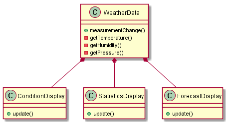
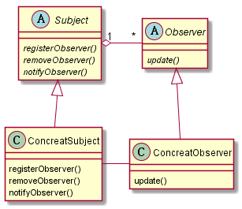

# 气象站的需求

建立一个应用，利用`WeatherData`对象取得数据，并更新三个布告板：目前状况、气象统计和天气预
报。

最简单的实现便是为三个布告板单独定义类并且创建各自的对象来完成数据的更新，我们称之为耦合
版本:

耦合版本针对具体实现进行编程，对于之后的新的需求不甚友好，比如我们需要增加或者删除布告板
的时候必须改动`WeatherData`。

# 观察者模式

> 观察者模式定义了对象之间的一对多依赖，这样一来，当一个对象改变状态时，它的所有依赖者都
会收到通知并自动更新。

观察者模式所定义的是基于接口的松耦合涉及，因此在改变观察者或者主题任一方的时候只需要遵循
已经订立的接口而不用改动整个框架。
