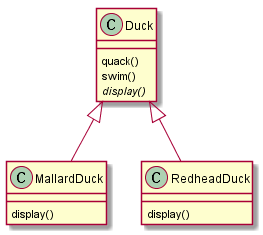
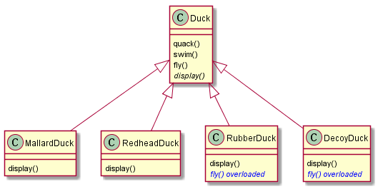
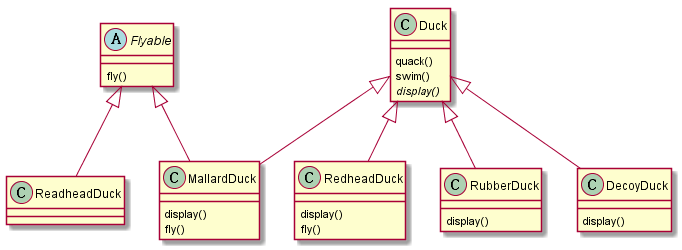

# 继承带来的问题

继承的复用特性很受欢迎，也经常被采用。但继承所带来的问题是无法很好地控制对其修改所带来的
影响，比如下面的设计：

当我们需要为`Duck`新增特性的时候必须顾及到它对所有子类所造成的影响，当给 `Duck`新增行的
为不适合某一子类的时候就会出现问题，而这种需求在现实中是完全可能的。

# 重载父类的方法

为了屏蔽针对父类的修改带给所有子类的影响，一个粗浅的方案是在相关的子类里面重载基类中的方
法。

这种方法是可行的。如果我们考虑这种设计的完美型它还是有瑕疵的，因为这将意味着以后每增加新
的子类必须对父类里面继承的所有方法进行完整性考虑，对于不需要与父类保持一致的方法需要重新
实现。

# 使用接口的设计

另一种可行的方法是将这些多样化的方法剥离成“接口”，强制需要此类方法的每个子类实现自身的版
本：

然而，这种方法看似灵活性很大，确可能引入另一个新的问题：`MallardDuck`和`Redhead`实现的
`fly()`存在着一定重复性。

使用接口面临的代码重复性问题在Java里面没有办法解决，因为Java接口不能实现代码，但这在C++
里面却不是问题，因为C++支持多重继承，尽管它可能违背了继承所应该具有的"is-a"关系。这个时
候我们可以采取的方法有两种（见《Effective C++》条款39的讨论）：

- 使用private继承。
- 使用组合。

采用组合策略将引出针对策略模式的讨论。

# 从组合方式中诞生的策略模式

# 参考

- 《Effective C++》条款 32：确定你的public继承塑模出is-a关系。
