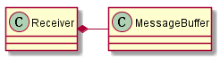

## 1.关联

关联是两个类之间的一种关系，这种关系允许从这两个类创建的实例之间会存在链接。关联最常见的
实现方式为：一个类中的实例变量指向或者引用到另外一个类，或者两个类之间可以互相发送消息。

通常把实体（类）之间连接起来的线来表示关联：

- 所有的关联都具有名字，名字都是动词或者动词短语。
- 关联的两段用`0..*`表示多重性，小三角图标指向两个实体之间关联组成句子的谓语。

关联都被认为是双向的，除非其上带有一个箭头，箭头的出现把知识限制在箭头所指的方向，关联就
只能够朝着箭头的方向前进，这意味着箭头指向的类不知道它的关联者。双向关联允许两个实体互相
知晓。

## 2. 聚合

聚合是一种特殊形式的关联，意味着“整体/部分”关系。它被表示为聚集类上一个白色菱形，和白色
菱形相邻的类是整体，另外一个类是部分。

## 3. 组合

组合是一种特殊形式的聚合，意味着“整体”负责它的“部分”的生存期。它被表示为一个黑色菱形。

## 4. 继承

继承。
抽象类的实现。
