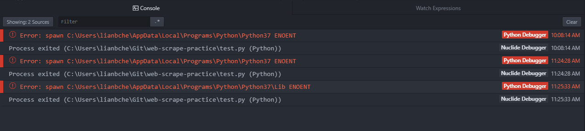

# ATOM

## 列模式

使用ctrl + alt + (up/down) 来选取列。

参考：

- https://discuss.atom.io/t/is-column-selection-available-in-atom/48418/3

## 给ATOM安装IDE

之前一直使用ATOM作为编辑器来编写python代码，但执行时都是另外打开窗口运行。今天突然想想能
否使用更高效的方式。于是有如下的尝试：

### 安装 `atom-ide-ui`插件

在安装了`atom-ide-ui`插件之后重启ATOM发现在菜单栏多了`Debugger`,`Nuclide`的选项，然而
这并没有解决最初直接在ATOM里面运行Python脚本的问题。

该插件仿佛是一个空盒子，其他的功能需要自己填充。比如我想启动调试来执行，但attach debugger
的时候提示找不到debugger，尽管此时我已经安装了`atom-ide-debugger-python`插件。难道要
再安装一个`python-debugger`插件？


在仔细搜索有关`atom-ide-ui`插件之后发现这款插件仅提供用户界面接口，对于其他的语言需要安
装对应的支持包才能协同工作。当前不支持python，因此将其卸载。

### 从python debugger 重新开始

昨天胡乱安装了一个插件[ide-python](https://atom.io/packages/ide-python)，今天重新搜
索主页发现：

```
ide-python requires Atom 1.21+, Python language server 0.19+ and the atom-ide-ui package to expose the functionality within Atom.
```

也即是说`ide-python`这个插件，也需要同时安装`python language server`和`atom-ide-ui`，
而`atom-ide-ui`[主页](https://atom.io/packages/atom-ide-ui)上又写到：

```
You'll also want to install a suitable language package and/or debugger package since atom-ide-ui doesn't provide any language or debugger support by default.

Language support packages based on https://github.com/atom/atom-languageclient should work out of the box with atom-ide-ui installed, such as:

    ide-csharp
    ide-flowtype
    ide-java
    ide-php
    ide-typescript
    and more...

These debugger packages should work out of the box:

    Node Debugger
    Python Debugger
    React Native Debugger
    C/C++ GDB Debugger
    OCaml Debugger
```

上面提供了语言支持包信息（从more...里面找到支持Python的`python-language-server`）和
Python Debugger。所以，对于Python的IDE支持需要有：

- [python-language-server](https://github.com/palantir/python-language-server)，
不是ATOM插件，而是独立的Python软件包。
- atom-ide-ui
- [atom-ide-debugger-python](https://atom.io/packages/atom-ide-debugger-python)
- ide-python

重新尝试，和之前一样的错误：



搜索`atom-ide-debugger-python how use`，之后在[atom-ide-debugger-python的issue页面](https://github.com/facebookarchive/atom-ide-debugger-python/issues/1)发现通过
菜单栏"Debugger -> Attach Debugger"无法找到debugger的原因在于当前并不支持attach操作，
而只能够launch。这是第一个问题的答案。

同时在阅读上面issue内容的时候看到里面给出了"Python Path"的完整路径，而之前自己仅仅给定了
上一层目录所以才有如下的错误：

```
Failed to start debugger process: Failed to launch the Python Process, please validate the path 'C:\Users\lianbche\AppData\Local\Programs\Python\Python37\'
```

在给定完整路径之后（如下）发现可以正常进行调试。


### 从编辑器里启动

两种方式：

- [platformio-ide-terminal](https://atom.io/packages/platformio-ide-terminal)	在
界面下方添加终端。
- [atom-python-run]() 按f5可以执行你的脚本，但是会有弹出窗口。


## ATOM代理设置

```
apm config list
apm config set https-proxy http://proxy:8080
```
