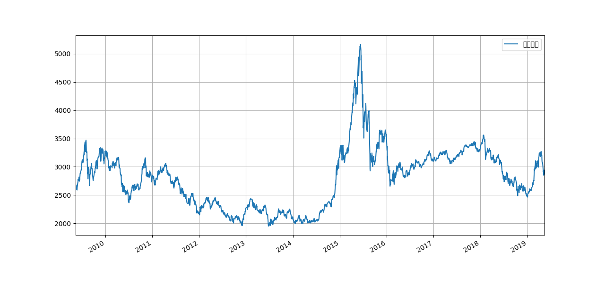

# 笔记索引

- [数据结构](./datastructure/README.md)
- [层次化索引](./hierarchical_index/README.md)
- [csv处理](./csv/README.md)
- [绘图](./plot/README.md)
- [web相关](./web/README.md)

# 学习材料

- [10 Minutes to pandas](http://pandas.pydata.org/pandas-docs/stable/getting_started/10min.html)
- [Data School](https://www.youtube.com/channel/UCnVzApLJE2ljPZSeQylSEyg)

# 常用属性及函数

属性：

- DataFrame.shape ：显示行、列信息。
- DataFrame.dtypes ：显示行的类型。

方法：

- DataFrame.head() ：默认显示前面5行的数据。
- DataFrame.describe() ：显示对应数据对应里面“数据列”的统计信息，包括count, min, max...
- DataFrame.describe(include=['object']) ：显示非数据列的统计信息，包括count, uniq, top, freq


# 常见问题

## 替换操作

使用`Series.replace()`或者`Series.str.replace()`两者来进行替换，前者默认进行全匹配，
后者默认进行子串匹配，不过我们可以使用`Series.replace()`里的正则功能，比如如下的代码将
名为index的Series的值里包含'(万元)'替换为空。

```
index = index.replace(to_replace='\(万元\)', value=' ', regex=True)
```

对DataFrme也是按照同样操作来进行替换，比如对于某列（对应Series）的操作：

```
df.column_name.str.replace('[', '').replace(']', '') # 将column_name列里的'[]'删除。
df.column_name.str.replace('[\[\]]', '') # 将column_name列里的'[]'删除，使用正则。
```

*注：在pandas里面使用字符串的功能，需要通过添加`.str`来完成字符串函数的调用。*

参考：

- [Update pandas DataFrame with .str.replace() vs .replace()](https://stackoverflow.com/questions/38117016/update-pandas-dataframe-with-str-replace-vs-replace)
- [pandas.Series.replace](https://pandas.pydata.org/pandas-docs/stable/reference/api/pandas.Series.replace.html)
- [pandas.Series.str¶](https://pandas.pydata.org/pandas-docs/stable/reference/api/pandas.Series.str.html#pandas.Series.str)


## 遍历操作

对于Series, Dataframe的遍历操作如下：

```
for c in ufo.city:
  print(c)

for index, row in ufo.interrows():
  print(index, row.City, row.State) # 打印City, State

```

## 通过多列的值来进行行选取操作

比如如下数据，我要将“所有列内容都小于某个值”的那些行删除掉，改如何操作？

```
                               002352     600233
报告日期
货币资金(万元)               1613112.0   406144.0
结算备付金(万元)                   0.0        0.0
拆出资金(万元)                     0.0        0.0
交易性金融资产(万元)               1444.0       79.0
衍生金融资产(万元)                  0.0        0.0
```

学习了DataSchool的一个视频，知道通过条件选择的原理来自于构建一个bolean的Series，因此可以
对这两列的内容进行求与操作来构建这样的series：

```
filter_condition = [True] * len(self.balance_df[0]['2018-12-31'])
for i in range(len(self.args.stock)):
    s = self.args.stock[i]
    self.multi_stocks_asset_df[s] = self.balance_df[i]['2018-12-31']
    filter_condition &= self.multi_stocks_asset_df[s] > 0

df_for_plot = self.multi_stocks_asset_df[filter_condition]
```

学习了另外一个视频之后，才知道通过多列来进行选择需要使用`&`或者`|`将条件进行逻辑计算，即
便如此，如要根据多列（事前未知）来进行选取依然需要使用如上代码实例里的方式。

```
df_for_plot = self.multi_stocks_asset_df[condition1 & condition2]
```

而对于单列多条件的选取，可以使用简便的方式:

```
movies[(movies.genre=='Crime') | (movies.genre=='Drama') | (movies.genre=='Action')]
movies[movies.genre.isin(['Crime', 'Drama', 'Action'])]
```

参考：

- [How do I filter rows of a pandas DataFrame by column value?](https://www.youtube.com/watch?v=2AFGPdNn4FM)
- [How do I apply multiple filter criteria to a pandas DataFrame?](https://www.youtube.com/watch?v=YPItfQ87qjM)


## 变更某一列内容的展现形式

比如现在有一列"日期"是按照“年-月-日”的形式展示的，现在需要让其展现为“年-月”的形式展示，
该如何操作？

```
df['month_year'] = df['date_column'].dt.to_period('M')
```

参考：

- [Extracting just Month and Year from Pandas Datetime column](https://stackoverflow.com/questions/25146121/extracting-just-month-and-year-from-pandas-datetime-column)
- [Series.dt ](http://pandas.pydata.org/pandas-docs/stable/reference/series.html#api-series-dt)


## DataFrame 输出排版

打印DataFrame输出的格式有些时候并不友好，比如：


## DataFrame 类型转换

想将整个 DataFrame的值转换为float类型进行计算，尝试`pd.to_numeric(m)`发现只能够转换单
维的数据。如果要转换所有列，那么需要使用循环，然而这种方式会返回新的对象，不是在原对象基
础上进行转换，使用起来不方便。

*注：调用`to_numeric()`时根据原有数据决定转换为`int64`还是`float64`。*

```
for col in float_df:    
    print(pd.to_numeric(float_df[col]))
```

通过`print(df.dtypes)`打印DataFrame各列的类型。

## DataFrame.plot 时中文显示乱码



解决方法为通过`plt.rcParams['font.sans-serif'] = ['SimHei'] `将字体设置为黑体。

参考：

- [python3用matplotlib绘图出现中文乱码的问题](https://www.cnblogs.com/Icarus-suixin/p/10641085.html)

## pandas.io.data 不可用

从0.19.0开始，pandas不再支持pandas.io.data or pandas.io.wb, 替代品为pandas_datareader。

参考：

- [Importing pandas.io.data(https://stackoverflow.com/questions/47972667/importing-pandas-io-data)
- [pandas-datareader](https://pandas-datareader.readthedocs.io/en/latest/#)
