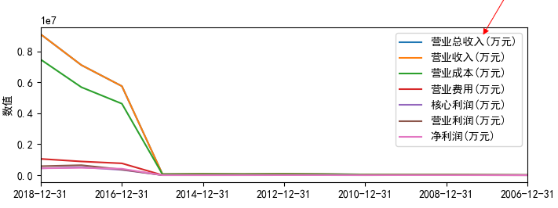
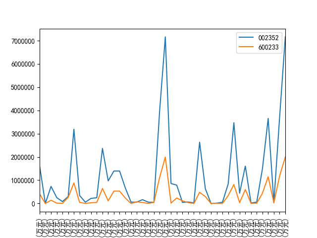

# 常见问题

## 去掉legend中显示的index名称

如果dataframe里面的index名称不为空，这在我们选取dataframe中某列做为index的时候是
很常见的，但在画图时该index的名称也会展示出来。


一种方法是在画图的时候指定显示的legend来提代默认的展示规则（展示dataframe中所有列名）

```
value_plot.legend(value_items.columns)
```



参考：

- [Modify the legend of pandas bar plot](https://stackoverflow.com/questions/33149428/modify-the-legend-of-pandas-bar-plot)

## X轴标签部分隐藏的问题

使用默认的显示方式有些时候无法显示出xlabel的所有内容，比如：



之前尝试解决过一次但是没有成功，这次经过多次搜索在StackOverflow上找到答案，即在`show()`
之前调用`plt.tight_layout()`，但这样整幅图的效果可能会比较怪异，比如被挤压：


可以通过以下方法调整：

- 调整 xlabel，避免使用太长、太多的展示。
- 通过`figsize`调整整幅图的大小。
- 通过`plt.subplots_adjust`来调整图形显示的边缘设置。

参考：

- [xlabel and ylabel out of plot region, cannot show completely in the figure
](https://stackoverflow.com/questions/29767386/xlabel-and-ylabel-out-of-plot-region-cannot-show-completely-in-the-figure)
- [How do you change the size of figures drawn with matplotlib?](https://stackoverflow.com/questions/332289/how-do-you-change-the-size-of-figures-drawn-with-matplotlib)


## 设置Y轴为百分比样式

参考：

- [Format y axis as percent](https://stackoverflow.com/questions/31357611/format-y-axis-as-percent)

## 如何调整横坐标样式以显示更多项目

如下图，怎么调整横坐标标签显示样式，支持更多的显示。


```
asset_plot = self.asset_df.plot()
asset_plot.set_xticks(range(len(self.asset_df.index)))
asset_plot.set_xticklabels(self.asset_df.index, rotation=90)
plt.show()
```

通过`set_xticks`设定所有的tick数，另外通过`set_xticklabels`设定标签的显示样式。

参考：

- [How to plot a pandas multiindex dataFrame with all xticks](https://stackoverflow.com/questions/21281322/how-to-plot-a-pandas-multiindex-dataframe-with-all-xticks)
- [Matplotlib:: Not Showing all x-axis data frame variable](https://stackoverflow.com/questions/32572419/matplotlib-not-showing-all-x-axis-data-frame-variable?rq=1)

## Subplot

DataFrame.plot()里的`subplots`参数是对每列的数据分开展示，不属于不同DataFrame的展示方
法。

```
import matplotlib.pyplot as plt

fig, axes = plt.subplots(nrows=2, ncols=2)

df1.plot(ax=axes[0,0])
df2.plot(ax=axes[0,1])
...
```

如果仅绘制1X2, 或者2X1的子图，那么索引ax的方式不一样：

```
fig, axes = plt.subplots(nrows=1, ncols=2)

df1.plot(ax=axes[0])
df2.plot(ax=axes[1])
```

参考：

- [How can I plot separate Pandas DataFrames as subplots?](https://stackoverflow.com/questions/22483588/how-can-i-plot-separate-pandas-dataframes-as-subplots)
- [Stuffing a pandas DataFrame.plot into a matplotlib subplot](https://stackoverflow.com/questions/21962508/stuffing-a-pandas-dataframe-plot-into-a-matplotlib-subplot/21967899#21967899)

## DataFrame.plot / 画图

pandas 为 DataFrame 提供了专门的绘图函数`plot`，支持多种参数。

```
DataFrame.plot(x=None, y=None, kind='line', ax=None, subplots=False, sharex=None, sharey=False, layout=None, figsize=None, use_index=True, title=None, grid=None, legend=True, style=None, logx=False, logy=False, loglog=False, xticks=None, yticks=None, xlim=None, ylim=None, rot=None, fontsize=None, colormap=None, table=False, yerr=None, xerr=None, secondary_y=False, sort_columns=False, **kwds)[source]
```

- x,y 默认为None，取用的是DataFrame的数据,y 指定列标签(label)或者位置(position)，可以
展示多列数据。
- kind 为图形形式，支持line, bar, barh, hist, box, pie, scatter
- subplots 是否为每一列数据单独做图
- sharex, sharey 当subplots为True的时候是否共享 axis label
- layout 部署subplot 的方式： tuple, rows, columns
- use_index 默认以 index作为 ticks for x axis
- title 放置在图形上方的标题，多个子图时传入列表
- grid 是否使能网格
- legend 防止图例： Ture/False/reverse
- secondary_y，默认False，指定哪些列数据采用辅坐标轴

画出图形时如果觉得周围留空过大的问题，在调查`X轴标签部分隐藏的问题`时找到方案，即是通过
`subplots_adjust`来调整显示，之前一直在针对dataframe的plot接口里面查找，所以才没有找到
调整方案。

```
plt.subplots_adjust(wspace=0.6, hspace=0.6, left=0.1, bottom=0.22, right=0.96, top=0.96)
```

另外可以通过`figsize `来设置总的大小。

```
dp = df_for_plot.plot(figsize=(2,2))
plt.figure(figsize=(2,2))
```

参考：

- [pandas.DataFrame.plot](https://pandas.pydata.org/pandas-docs/stable/reference/api/pandas.DataFrame.plot.html)
- [xlabel and ylabel out of plot region, cannot show completely in the figure
](https://stackoverflow.com/questions/29767386/xlabel-and-ylabel-out-of-plot-region-cannot-show-completely-in-the-figure)
- [How do you change the size of figures drawn with matplotlib?](https://stackoverflow.com/questions/332289/how-do-you-change-the-size-of-figures-drawn-with-matplotlib)
